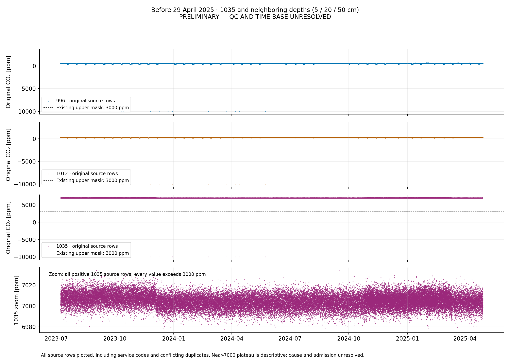

# Глава 2: определения и проверка данных

[Критерии допуска I.G.](#ig-admission-criteria) ·
[Первое расширение архива: сентябрь 2013](#archive-september-2013) ·
[Единый проход всего архива](#full-archive-pass) · [Итоговые траектории](#archive-trajectories).

<a id="ig-admission-criteria"></a>

## Критерии допуска I.G. и утверждённая реализация

Источник численных критериев — [аудит I.G., страницы 3 и 5](../../Papers/LEO_CO2_sensor_audit_2026-06-30.pdf#page=3).
Технические определения ниже я принял **30.09.2026** и реализовал
в существующем [chapter02.py](../chapter02.py). Они применяются одинаково ко всем
месяцам W_R4_C-4; прежние выбранные интервалы не являются основанием допуска.
Это самостоятельная воспроизводимая реализация опубликованных критериев,
а не утверждение о совпадении с внутренними вычислениями I.G.

| Операция | Правило источника | Принятая техническая реализация |
|---|---|---|
| Служебные значения и диапазон, стр. 3 | Исключить $C\leq-9999$; допустимо $0<C\leq3000$ ppm | Маска рабочей копии; исходные строки неизменны, пропуски не интерполируются |
| Повторные метки | Способ не указан | Точные повторы объединяются только в рабочей копии; при разных значениях исключается вся соответствующая временная метка. Другие метки суток сохраняются |
| Постоянные участки | Порог длительности не указан | Длительность сохраняется как диагностика, без автоматического исключения. Два индивидуальных ноябрьских исключения сохраняются только на своих датах |
| Одиночные выбросы, стр. 3 | Удалить изолированные выбросы после диапазонного фильтра; формула не указана | Центрированное окно 7 наблюдений, порог $6\cdot1{,}4826\cdot\mathrm{MAD}$; только однозначный одиночный выброс. Неоднозначность сохраняется |
| Допустимые сутки, стр. 5 | Не менее 10 допустимых суточных записей за месяц; покрытие суток не определено | Для каждого датчика: ≥2 разные временные метки в каждом интервале [0,6), [6,12), [12,18), [18,24) ч; полный ранг модели. Окружение ±12 ч здесь не требуется |
| Медианная концентрация, стр. 5 | 100–2000 ppm включительно | Медиана суточных медиан очищенной концентрации только допустимых суток; одинаковый вес каждого дня |
| Медианная суточная амплитуда, стр. 5 | ≥8 ppm | Для каждого допустимого дня подгонка очищенной **исходной концентрации**: свободная константа + cos/sin периода 24 ч; $A=\sqrt{a^2+b^2}$. Затем месячная медиана |

Порог 8 ppm относится к месячной медиане, а не к отдельным суточным амплитудам.
Диапазон концентрации не переносится на амплитуды. Для месячного критерия
**не вычитается скользящее среднее**; эта подгонка отличается по входу от H/A.

### Воспроизводимый детектор одиночного отклонения

Для отсортированного ряда одного датчика рассматриваются семь последовательных
уникальных исходных меток. Окно допустимо для детектора, только если все семь
значений прошли предыдущие маски и все шесть интервалов положительны, причём
отношение максимального интервала к минимальному не превышает существующий
`GAP_FACTOR = 1.5`. Это технический способ не пересекать разрывы и смену частоты
регистрации; календарные эпохи и новое правило исправности не вводятся.
Окно на краю ряда не смещается и не дополняется.

В окне вычисляются медиана $m$ и $\mathrm{MAD}=\mathrm{median}|C_i-m|$.
При положительном MAD центр удаляется только тогда, когда он один выходит
за полосу $m\pm6\cdot1{,}4826\cdot\mathrm{MAD}$, остальные шесть значений
находятся внутри и соседние центры окон не являются кандидатами.
Это однопроходное решение по исходной рабочей копии, без повторного удаления.
Последовательности повышенных значений не удаляются как одиночный выброс.

При MAD=0 постоянное окно не вызывает сомнения. Непостоянный центр такого
окна сохраняется с флагом `zero_MAD_deviation`. Кандидат с неоднозначной
изолированностью сохраняется с флагом `ambiguous_excursion`.
Неполное окно или граница регистрации сами по себе не исключают измерение.
Для каждого исключения или сомнения записывается конкретная причина.

### Влияние сомнительных значений и месячный статус

Сомнительные значения не удаляются автоматически. Записанные месячные метрики
вычисляются с их сохранением. Дополнительно проверяются возможные решения
«сохранить / исключить» для отмеченных значений:

- Для суток с ≤10 сомнительными значениями перебираются все подмножества;
  проверяются покрытие, ранг и обе суточные метрики.
- Для большего числа используется гарантированная внешняя оценка, а не
  случайный перебор. Для концентрации — пределы значений суток. Для амплитуды
  — оценка возмущения МНК при удалении любого подмножества; если матрица
  оставшихся несомненных строк вырождена, верхняя граница бесконечна.
- При переходе к месячной медиане учитываются все возможные числа допустимых
  суток и равный вес дней. Предел 10 в первом пункте ограничивает объём точного
  перебора, **не является критерием качества** и не разрешает сомнительное измерение.

Для проверки оценки МНК: $X$ содержит столбцы $1,\cos\omega h,\sin\omega h$,
$\beta$ — решение с сохранёнными сомнительными отсчётами, $e=y-X\beta$.
Пусть $U$ — сомнительные строки, $K$ — несомненные. Для любого подмножества
удаляемых строк $S\subseteq U$ при положительном знаменателе

$$
\lVert\beta_{-S}-\beta\rVert_2\leq
\frac{\sum_{i\in U}\lVert x_i\rVert_2|e_i|}
{\lambda_{\min}(X_K^{\mathsf T}X_K)}.
$$

Та же величина ограничивает изменение амплитуды; её нижняя граница обрезается
нулём. Это проверка устойчивости **решения о допуске**, не новая характеристика
CO₂, статистический тест или оценка физической ошибки фазы.
Внешние оценки консервативны: неопределённость не означает доказанного нарушения.

`pass`: все три месячных условия выполнены при любом допустимом решении
по сомнительным измерениям. `fail`: хотя бы одно условие заведомо нарушено.
`undetermined`: сохраняется вопрос обработки, способный изменить проверку;
инвариантность допуска не установлена. Само отличие реализации от I.G.
не является причиной `undetermined`. Таблицы содержат фактические показатели,
границы их возможного изменения и причины каждого решения.

Совместный месячный статус трёх датчиков: `fail`, если хотя бы один получил
`fail`; иначе `undetermined`, если он есть у одного из датчиков; иначе `pass`.
Месяцы без записей получают `fail` по недостатку допустимых суток.

### Месячный допуск и окончательные H/A

Для H/A нужны совместный `pass` календарного месяца рассматриваемого дня,
полные общие сутки и фактическое окружение ±12 ч по прежнему алгоритму главы 1.
Контекст берётся из той же очищенной рабочей копии, без разрыва на границе
месяца. Сомнительный отсчёт в требуемом окружении препятствует включению суток
в окончательную траекторию, даже если месячное решение от него не зависит.
Отсутствующие оценки сохраняются с причинами; линии через пропуски не проводятся.

Это разные условия: месячное число допустимых дней не равно числу окончательных
точек H/A. В H/A по-прежнему используется остаток после центрированного
24-часового среднего; математический метод и окно ±12 ч не изменены.
R² сохраняется без нового порога. Нулевая или численно неразличимая амплитуда
даёт неопределённое время максимума. Месячный допуск не доказывает физическую
надёжность каждой фазы.

[Глава 2](../02_monthly_changes.ipynb) · [Результаты полного прохода](#archive-trajectories) · [План](../PLAN.md)


<a id="daily-trajectories"></a>

## Выбранные характеристики и их источники

Для расширения главы 1 использую **время максимума и амплитуду суточной
гармоники**. Это два основных выхода главы 2; амплитуда является высотой
максимума гармонической части относительно её постоянного уровня.

**Основание выбора:**

- I.G., `LEO_CO2_sensor_audit_2026-06-30.pdf`, раздел 7, стр. 21–23:
  время максимума суточного фазора и затухание амплитуды по глубине.
  На стр. 21 указаны времена 14,34 / 18,21 / 21,43 ч и амплитуды
  18,07 / 17,62 / 8,40 ppm; рисунки 17–18 показывают эти характеристики
  отдельно. Это годичные оценки аудита, а не результаты нашего октября.
- P. A. Deymier, K. Runge, J. O. Vasseur, *Geometric phase and topology of
  elastic oscillations and vibrations in model systems: Harmonic oscillator
  and superlattice*, AIP Advances 6, 121801 (2016), стр. 121801-1:
  [DOI](https://doi.org/10.1063/1.4968608). Введение использует амплитуду
  и фазу колебаний, в том числе комплексную амплитуду. Это работа об упругих
  системах; она не задаёт алгоритм расчёта максимумов концентрации CO₂.

Для LEO беру конкретный выбор I.G. и вычислительную реализацию главы 1.
Сходство набора характеристик не означает тождества алгоритмов: аудит
использует часовую сетку и заполнение части пробелов, глава 1 сохраняет
исходные метки без интерполяции. Нашу подгонку не объявляю точным
воспроизведением не приведённого в аудите алгоритма.

**Фиксированное допущение:** период равен 24 часам. Не пересматривать его
и не возвращать вопрос о выборе периода на обсуждение до явной инициативы I.G.

### Области определения, значения и единицы

$v$ — выбранная колонка; $j=1,2,3$ — три её фиксированных уровня;
$I=[t_0,t_1)$ — выбранный интервал календарного времени. Уровни и их
sensorid сохраняются в результатах: D4 не переименовывается в D3.
Суточные параметры определяются на множестве $\mathcal D_{v,I}$ дней,
для которых у всех трёх каналов доступны допустимые окна подгонки.
Для времени пика дополнительно требуется ненулевая амплитуда; качество
оценки фиксируется отдельно. Отсутствующая оценка не заменяется нулём.

| Величина | Определение и пространство значений |
|---|---|
| Исходные числовые показания $C^{\mathrm{raw}}_{v,j}(t)$ | Значения в $\mathbb R\,\mathrm{ppm}$ на исходных метках; служебные коды и недопустимые показания ещё не являются физическими концентрациями |
| Допущенные концентрации $\mathbf C_v(t)$ | Тройка концентраций на совместно доступных моментах, $\mathbf C_v(t)\in((0,3000]\,\mathrm{ppm})^3$ по [диапазонному допуску I.G.](#ig-admission-criteria); полный допуск включает и остальные критерии |
| Среднее $m_{v,j}(t)$ и остаток $r_{v,j}(t)$ | Среднее в полном окне ±12 ч и $r=C-m$ на пригодных метках; единицы ppm. Для допущенных концентраций $m\in(0,3000]\,\mathrm{ppm}$ и $r\in(-3000,3000)\,\mathrm{ppm}$ |
| Модель $\widehat r_{v,j}(d,h)$ и коэффициенты $c,a,b$ | Значения в $\mathbb R\,\mathrm{ppm}$; $d\in\mathcal D_{v,I}$, $h\in[0,24\,\mathrm{ч})$. Подгонка сама по себе не наследует диапазон входных концентраций |
| Амплитуда $A_{v,j}(d)$ | $\sqrt{a_{v,j}(d)^2+b_{v,j}(d)^2}\in[0,\infty)\,\mathrm{ppm}$ |
| Время максимума $h_{v,j}(d)$ | $\omega^{-1}\mathrm{atan2}(b_{v,j}(d),a_{v,j}(d))\pmod{24\,\mathrm{ч}}$, представитель в $[0,24\,\mathrm{ч})$; при $A=0$ не определено |
| Угловая координата пика $\phi_{v,j}(d)$ | $\omega h_{v,j}(d)\pmod{2\pi}\in\mathbb R/(2\pi\mathbb Z)$, радианы; это фаза максимума в соглашении главы 1 |
| Междатчиковый сдвиг $\Delta_{v,jk}(d)$ | $\mathrm{wrap}_{24}(h_{v,k}(d)-h_{v,j}(d))\in[-12,12)\,\mathrm{ч}$ |

Здесь $\omega=2\pi/(24\,\mathrm{ч})$ имеет единицы рад/ч, а
$\mathrm{wrap}_{24}(u)=((u+12\,\mathrm{ч})\bmod24\,\mathrm{ч})-12\,\mathrm{ч}$.
Диапазон — множество допустимых значений, не утверждение, что конкретные
измерения достигают каждой его точки. Фактический образ функции определяется данными.
Тройка исходных концентраций требует совместимых временных меток;
суточные подгонки, как в главе 1, сохраняют собственные метки каждого канала.

Для гармонической части $s_{v,j}(d,h)=\widehat r_{v,j}(d,h)-c_{v,j}(d)$:

$$
s_{v,j}(d,h)=A_{v,j}(d)\cos\bigl(\omega(h-h_{v,j}(d))\bigr),\qquad
s_{v,j}(d,h)\in[-A_{v,j}(d),A_{v,j}(d)],\qquad
\max_h s_{v,j}(d,h)=A_{v,j}(d).
$$

$s$ и $A$ измеряются в ppm. Таким образом, выбранная «величина максимума»
имеет один смысл: амплитуда выделенной гармоники. Максимум модели отклонений
с постоянным слагаемым равен $c+A\in\mathbb R\,\mathrm{ppm}$; он не является
дополнительным выходом главы 2. Максимум исходной концентрации не подменяет $A$.

Две суточные траектории:

$$
\mathbf H_v(d)\in\mathbb T_{24}^3,
\qquad \mathbf A_v(d)\in([0,\infty)\,\mathrm{ppm})^3,
\qquad \mathbb T_{24}=\mathbb R/(24\,\mathrm{ч}\,\mathbb Z).
$$

Здесь $\mathbb Z=\{\ldots,-2,-1,0,1,2,\ldots\}$ — множество целых чисел.
В обозначении $\mathbb T_{24}=\mathbb R/(24\,\mathrm{ч}\,\mathbb Z)$
времена, отличающиеся на целое число суток, считаются одинаковыми
(например, 23 и 47 часов задают одну точку цикла).

Куб $[0,24\,\mathrm{ч})^3$ представляет тор с отождествлёнными противоположными
гранями. $\mathbf H$ объединяет скалярные $h_j$ главы 1; это наше обозначение
вектора, а не приписываемое источникам обозначение. Цвет точки обозначает дату.
Разрывы не соединяются; циклический переход через полночь не изображается
как скачок почти на 24 ч. Две независимые относительные фазы на
$\mathbb T^2$ остаются производным представлением для дальнейшего анализа.

**[Критерии допуска I.G.](#ig-admission-criteria) сохраняются.**
Список фильтров, пороги и недостающие определения собраны в справочном разделе
выше. Пороговые правила не заменяют проверку определимости фазы
и не меняются при выборе другой колонки.
Отсутствующий в PDF точный алгоритм допуска
необходим для самостоятельного исследования
пригодности дополнительных данных. Эта задача
сохранена в [архиве](archived/03_data_admission.ipynb) и не является обязательным
условием выполнения действующего
исследовательского плана.

[Постановка главы 2](../02_monthly_changes.ipynb) · [Критерий завершения](../PLAN.md#chapter-2)

## История расчётов до утверждения полной процедуры

Следующие разделы сохраняют результаты и решения прежних этапов. Их числа,
ограничения обработки и отложенные вопросы относятся к указанным снимкам;
они не задают текущий месячный допуск. Действующая процедура приведена
[выше](#ig-admission-criteria), новый полный результат — [ниже](#archive-trajectories).

## Сохранённая проверка ноябрьского примера

**Навигация после сокращения главы:** прежние разделы 2.1–2.12 и рисунки
2.1–2.11 сохранены в [пошаговом notebook](02_worked_examples.ipynb).
Ссылки на эти номера ниже относятся к нему. Новая основная глава содержит
сравнение месяцев; его метод описан [отдельно](#month-comparison).


[Оглавление](../README.md) · [Глава 2](../02_monthly_changes.ipynb) · [Подробности](README.md)

## Почему расчёт всего ноября ещё не выполнен

Ноябрь выгружен тем же запросом для той же колонки, что и октябрь. В октябре
не было повторных временных меток, шагов до 10 секунд и непрерывных постоянных
участков от часа. В ноябре все эти особенности есть.

**Рабочее решение от 25.09.2026:** оба выявленных длительных залипания считаю
периодами неработоспособности и исключаю из рабочих рядов.
Это принятое правило пригодности
данных; конкретная техническая причина залипания не установлена.

Прежняя функция суточного анализа явно отказывается принимать повторные временные
метки. Удаление, усреднение повторов или выбор одного значения изменили бы подготовку
данных; такое правило ещё не принято. Повторы оставляю в основной главе кратким
примечанием для обсуждения с I.G. Подробные сведения сохранены ниже.
После исключения двух залипаний проверено покрытие суток по времени.
После примеров 16 и 17 ноября расчёт расширен до 16–24 ноября: среднее,
отклонения, параметры 24-часовой модели и взаимные сдвиги. Контексты этих дней
не содержат повторных меток; девять суток не заменяют расчёт всего месяца.

## Повторные временные метки

Для записей одного датчика $(t_i,y_i)$ обозначим

$$
n(t)=\#\lbrace i:t_i=t\rbrace,\qquad
s(t)=\max_{i:t_i=t} y_i-\min_{i:t_i=t} y_i.
$$

Повторная метка имеет $n(t)>1$. Если $s(t)>0$, значения на одной метке различаются.
Сравнение выполняется по значениям выгрузки без предварительного округления.

| Уровень | Повторных меток | Из них с разными значениями | Лишних точных повторов |
|---|---|---|---|
| D1 | 26 | 10 | 16 |
| D2 | 24 | 9 | 15 |
| D3 | 23 | 9 | 14 |

Все повторные группы содержат по две строки. Всего 73 лишних записи относительно
уникальных пар `(sensorid, localdatetime)`: 45 точных повторов и 28 случаев
различающихся значений. Ни одна строка не удалена.

Например, 06.11.2017 в 16:20:05 датчик D1 имеет значения около 407,716735
и 406,480185 ppm. Дополнительный SELECT показывает разные `VALUEID`:
705360751 и 705361217. Это две записи базы; повтор не появился при сохранении CSV.
[Все шесть записей трёх датчиков](../data/ch02/database_duplicate_example.csv).

Проверочный запрос: `SELECT valueid, localdatetime, sensorid, variableid, datavalue`
из `leo_west.datavalues`, `variableid=9`, `sensorid IN (994,1010,1026)`,
`2017-11-06 16:20:00 <= localdatetime < 2017-11-06 16:20:20`.
Поля таблицы проверены через `all_tab_columns` для владельца `LEO_WEST` и
таблицы `DATAVALUES`; отдельного признака качества или источника записи там нет.

## Постоянные участки

Ищутся последовательности с точно равным `datavalue`. Разрыв длиннее 1,5
медианного положительного шага завершает последовательность. В таблицу выводятся
участки длительностью от одного часа. Час — только порог диагностического списка,
а не физический критерий неисправности. Коды ошибки не считаются концентрацией.

| Интервал | Длительность | Записей на датчик | D1, ppm | D2, ppm | D3, ppm |
|---|---|---|---|---|---|
| 12.11 06:10:04 — 14.11 23:55:08 | 65,751 ч | 1435 | 403,656928 | 356,966982 | 343,270896 |
| 26.11 06:25:05 — 26.11 08:25:03 | 1,999 ч | 25 | 407,968442 | 364,734249 | 374,370473 |

Каждый датчик повторяет своё значение; значения трёх датчиков не равны друг другу.
Начало и конец обоих участков совпадают у трёх уровней. Прямая на рисунке проходит
через реально сохранённые записи; это не интерполяция между концами пропуска.
На длинном постоянном участке остаются близкие и повторные временные метки.
Причина (измерение, регистратор, загрузка или хранение данных) пока не установлена.

Оба перечисленных интервала исключены из рабочих рядов,
с включением первой и последней постоянной записи.
В исходном CSV записи сохраняются. В рабочем ряду им соответствует отсутствующее
значение (`NaN`): ноль означал бы концентрацию 0 ppm и изменил бы расчёт.
Пропуски после исключения не заполняются интерполяцией.
Случайное совпадение нескольких соседних измерений пока не служит основанием
для исключения: решение относится к двум явно обнаруженным длительным залипаниям.
В каждом ряду исключены $1435+25=1460$ записей; осталось $10582-1460=9122$.
Это число оставшихся строк, а не подтверждённых независимых измерений.

Метод `report.working_rows()` возвращает копию всех исходных строк с двумя
дополнительными полями: `excluded_stuck` отмечает исключение, а
`datavalue_for_analysis` содержит `NaN` на исключённых участках и исходное значение
в остальных строках. Поле `datavalue` сохраняет исходные значения везде.
Временные метки, повторы и порядок строк остаются прежними.

`report.save_working_data()` сохраняет эту таблицу в
[november_2017_working.csv](../output/ch02/november_2017_working.csv),
а число исключений — в [november_2017_exclusions.csv](../output/ch02/november_2017_exclusions.csv).
Производные файлы находятся вне неизменяемого снимка `data/ch02/`.
В `chapter02.py` явно указаны два принятых интервала; автоматического исключения
всех участков из диагностического списка нет.

## Шаг и число записей

В каждом ряду 2262 интервала между соседними строками имеют длину от 0 до 10 секунд.
Медиана положительного шага — 299 секунд. Небольшие шаги не объявляются дублями
автоматически: разные временные метки сохранены без слияния.

На рисунке число записей за сутки одинаково для D1/D2/D3. Линия 288 — арифметический
ориентир $24\cdot60/5$ для шага ровно 5 минут. Это не проверка достоверности и не
порог отбора. С 7 по 14 ноября бывает 514–533 записи за сутки; 30 ноября — 519.
Если все строки имеют одинаковый вес, более частые записи увеличивают вклад
соответствующих периодов в среднее и МНК. Причину увеличенной частоты надо выяснить.

В каждом ряду найдено 7 промежутков длиннее $1{,}5\cdot299=448{,}5$ секунд.
Самый длинный — 59 231 секунд (около 16,45 часа) перед 03.11 15:47:15.
Это длина интервала между соседними записями, а не число потерянных измерений.
Полный список: [reference_gaps.csv](../data/ch02/reference_gaps.csv).

<a id="day-coverage"></a>

## Полные сутки и окружающее окно

Календарь (рисунок 2.4) проверяет, достаточно ли данных **по времени** для прежней
обработки. Среднее и фазы здесь не вычисляются. В обеих строках требуется полное
покрытие одновременно у D1, D2 и D3; совпадение их точных временных меток не требуется.

**Верхняя строка:** сутки от 00:00 до следующих 00:00 целиком лежат внутри
непрерывного участка оставшихся записей каждого датчика. Интервалы строятся по
временным меткам после исключения залипаний; разрыв больше 448,5 секунды прерывает
покрытие. Это тот же множитель 1,5 медианного положительного шага, что и раньше.
Полное покрытие есть у 19 суток: **4–5, 7–11, 16–25, 28–29 ноября**.

**Нижняя строка:** дополнительно для каждой используемой точки нужно полное
окно суточного среднего. На непрерывном участке $[a,b]$ оставляю только моменты

$$
a+12\,\mathrm{h}\leq t_i\leq b-12\,\mathrm{h}.
$$

Затем по этим фактическим временным меткам строю интервалы покрытия и проверяю,
содержат ли они целые сутки. Используются общие функции подготовки октябрьского
расчёта: правила границ и разрывов сохранены. Дополнительных строк, интерполяции
или допущения о данных за границами выгрузки нет.

После этой проверки остаются **15 суток: 7–10, 16–24, 28–29 ноября**.
По сравнению с верхней строкой отпадают ещё **4, 5, 11 и 25 ноября**:

| День | Почему не хватает окружающего окна |
|---|---|
| 4 ноября | После разрыва 2–3 ноября записи возобновляются только 3 ноября в 15:47:15; для первых часов 4 ноября не хватает предшествующих 12 часов |
| 5 ноября | Разрыв 6 ноября в 08:30:02–09:06:11 попадает в будущую часть окна позднего вечера 5 ноября |
| 11 ноября | Залипание начинается 12 ноября в 06:10:04; часть вечерних окон 11 ноября заходит в исключённый участок |
| 25 ноября | Залипание 26 ноября с 06:25:05 затрагивает будущую часть вечерних окон 25 ноября |

Серая клетка означает **неполное покрытие суток для данного правила**, а не отсутствие
всех записей или доказанную неисправность весь день. В частности, первые и последние
сутки ограничены границами месячной выгрузки. Даже несколько секунд между полуночью
и первой/последней записью не дополняются автоматически: критерий консервативный,
как в октябрьской главе. Части серых дней могут быть полезны для других расчётов.

Повторные метки не увеличивают покрытый интервал времени. Для этой проверки
не требуется выбирать между их значениями; исходные строки сохраняются.
Зелёная клетка не решает вопрос повторов, не оценивает калибровку, форму суточной
волны или точность её фазы. Прежний запрет подгонки рядов с повторными метками сохранён.

Числа воспроизводятся через `report.table("coverage")`; колонки `D1_records` и
`D1_window` (аналогично D2/D3) относятся к отдельным датчикам, `common_records`
и `common_window` требуют одновременного выполнения для всех трёх.
`report.save_coverage()` сохраняет [таблицу календаря](../output/ch02/november_2017_day_coverage.csv).
Она находится вне исходного снимка данных.

<a id="november-16-trend"></a>

## Среднее и отклонения за 16 ноября

<a id="why-november-16"></a>

**Почему начинаю с 16 ноября 2017 года.** После октября 2017 из главы 1 перехожу
к следующему месяцу на той же колонке. **16 ноября — произвольно выбранный
начальный пример среди дней с полным набором суточных данных и окружающим окном.**
Это не случайная статистическая выборка. 16 ноября — первые полные сутки после
длительного залипания 12–14 ноября, для которых хватает окружающих данных
для прежнего окна ±12 часов. За 15 ноября полного покрытия нет.
У каждого датчика 16 ноября 288 записей; в контексте 15–17 ноября нет повторных меток.
Выбор сделан на этапе подготовки, до оценки амплитуд, фаз и R².
Это рабочий начальный пример, не специально выделенное физическое событие
и не обоснование представительности дня для всего ноября. Подходящие по времени
дни до залипания тоже есть; их обработка потребует учесть особенности частоты и повторы.

Для первого примера после проверки покрытия беру **16.11.2017**, W_R4_C-4,
D1/D2/D3 (994/1010/1026). На каждом датчике за день 288 исходных записей,
с 00:00:03 до 23:55:05. Все они имеют полное окружающее окно.

Контекст расчёта — **[15.11.2017 00:00, 18.11.2017 00:00)**, то есть 15–17 ноября.
В нём по 756 записей на датчик, повторных временных меток нет.
Утренние пропуски 15 ноября не входят в окна точек 16 ноября.
Среднее не считается только по показаниям внутри 16 ноября: ранним точкам нужны
данные 15 ноября, поздним — 17 ноября. На рисунке оставлен только исследуемый день.

Использую прежнюю функцию `daily_trend()` из общего модуля подготовки.
Для каждого датчика $j$ и момента $t$ определяю множество отсчётов

$$
W_j(t)=\lbrace i:t-12\,\mathrm{h}\leq t_{j,i}<t+12\,\mathrm{h}\rbrace,
\qquad n_j(t)=\#W_j(t),
$$

$$
m_j(t)=\frac{1}{n_j(t)}\sum_{i\in W_j(t)}C_j(t_{j,i}),
\qquad r_j(t)=C_j(t)-m_j(t).
$$

Отсчёты внутри полного окна имеют одинаковый вес. Это среднее исходных показаний,
без интерполяции или перевода на новую временную сетку. Оно отличается от одной
постоянной средней концентрации за календарные сутки: окно сдвигается вместе с $t$.
В окнах этого примера от 287 до 289 записей; число определяется фактическими
временными метками, а не заранее фиксируется равным 288.
В контексте примера медианный положительный шаг равен 300 секундам;
разрыв больше $1{,}5\cdot300=450$ секунд прерывает участок для среднего.
Календарь всего месяца использует медиану 299 секунд; эта разница не меняет
разбиение участков, нужных для 16 ноября.

На рисунке 2.5 все левые панели используют одинаковую шкалу концентрации,
все правые — одинаковую симметричную шкалу отклонений. Цвет относится к датчику;
чёрная линия слева — $m_j(t)$; пунктир справа — ноль.
$r_j(t)>0$ означает показание выше окружающего среднего, $r_j(t)<0$ — ниже.
Это ещё не выделенная гармоника: в остатках сохраняются быстрые колебания и
несинусоидальная форма. Никакие всплески на этом шаге не удаляются.

| Датчик | Точек за 16 ноября | Диапазон среднего, ppm | Диапазон отклонений, ppm |
|---|---|---|---|
| D1 | 288 | 417,81–421,80 | −37,49…40,46 |
| D2 | 288 | 371,15–378,60 | −29,54…34,89 |
| D3 | 288 | 365,75–371,86 | −23,44…24,00 |

Эти диапазоны — минимальное и максимальное вычисленные значения, не амплитуды
гармоники и не доверительные интервалы. Параметры гармоники приведены в следующем разделе.

`report.table("example_trend")` возвращает 864 строки: `level`, `localdatetime`,
`sensorid`, `datavalue`, `trend_24h`, `residual`. Метод
`report.save_example_trend()` сохраняет [численный результат](../output/ch02/november_2017_example_trend.csv).
Исходный снимок данных не меняется. Проверка повторных меток выполняется до расчёта
этого примера; при повторах или неполных окнах программа останавливается.

<a id="november-16-harmonic"></a>

## Одна 24-часовая гармоника за 16 ноября

Вход — те же 288 отклонений $r_j(t_i)$ каждого датчика из предыдущего шага.
К ним применяю прежнюю функцию `fit_diurnal()`, без удаления всплесков, изменения
временных меток или повторной фильтрации. Метод наименьших квадратов выбирает $c_j,a_j,b_j$:

$$
\widehat r_j(t)=c_j+a_j\cos\left(\frac{2\pi h(t)}{24}\right)
                   +b_j\sin\left(\frac{2\pi h(t)}{24}\right),
\qquad \sum_i\bigl(r_j(t_i)-\widehat r_j(t_i)\bigr)^2\to\min.
$$

Здесь $h(t)$ — местное время суток в часах с учётом секунд. Период **задан** равным
24 часам. Подгонка одной суточной записи не доказывает, что этот период устойчив
в остальном ноябре или найден независимо от выбранной модели.

$$
A_j=\sqrt{a_j^2+b_j^2},\qquad
h_{\max,j}=\frac{24}{2\pi}\mathrm{atan2}(b_j,a_j)\pmod{24}.
$$

На рисунке показана полная модель, включая $c_j$. После вычитания скользящего среднего
среднее остатка за отдельные календарные сутки не обязано быть нулём.
Для D1/D2/D3 получены $c_j\approx-0{,}275/-0{,}206/-0{,}636$ ppm.

| Датчик | Отсчётов | Амплитуда A, ppm | Максимум модели | R² |
|---|---|---|---|---|
| D1 | 288 | 19,87 | 13:59 | 0,70 |
| D2 | 288 | 19,40 | 18:30 | 0,81 |
| D3 | 288 | 8,97 | 22:17 | 0,44 |

Амплитуда — расстояние от уровня $c_j$ до вершины модели; полный перепад гармоники
равен $2A_j$. Максимум модели отличается от времени самого высокого отдельного
показания. Подписи до минуты — округление, а не оценка точности определения фазы.

$$
R_j^2=1-\frac{\sum_i(r_j(t_i)-\widehat r_j(t_i))^2}
                 {\sum_i(r_j(t_i)-\overline r_j)^2}.
$$

В этот день одна гармоника описывает около 70% разброса отклонений D1, 81% у D2
и 44% у D3. Для D3 большая часть разброса остаётся вне модели. Это не означает
автоматически неисправность D3: разность включает быстрые колебания и особенности
формы, которые одна синусоида не воспроизводит. R² не задаёт погрешность времени максимума.
Общие пояснения: [амплитуда и максимум](01_methods.md#harmonic), [смысл R²](01_methods.md#r-squared).
Числа в этих общих пояснениях относятся к октябрю; таблица выше — только к 16 ноября.

Серая линия рисунка 2.6 — исходные отклонения, цветная — модель; вертикальный пунктир
проходит через максимум модели. Шкалы трёх панелей одинаковы. Плавная линия модели
вычислена по формуле на более частой сетке исключительно для рисунка; подгонка и R²
используют только исходные 288 временных меток каждого датчика.

`report.table("example_diurnal")` возвращает коэффициенты, амплитуды, максимумы и R²;
`report.table("example_diurnal_values")` — исходные отклонения, `fitted_residual`
и разность `fit_error = residual - fitted_residual` на фактических метках.
Метод `report.save_example_diurnal()` сохраняет
[параметры](../output/ch02/november_2017_example_diurnal_summary.csv) и
[значения на исходных метках](../output/ch02/november_2017_example_diurnal_values.csv).
Снимок `data/ch02/` не меняется. Взаимные сдвиги приведены в следующем разделе;
сравнение с октябрём ещё предстоит.

<a id="frequency-scope"></a>

### Принятая суточная модель

Период **24 часа фиксирован**. Не пересматривать его и не возвращать вопрос
о выборе периода на обсуждение до явной инициативы I.G.

Непредставленная моделью часть сигнала сохранена в `fit_error` и учтена в R².
У D3 17 ноября модель описывает около 38% разброса; оставшиеся 62% не
приписываю автоматически шуму. Это ограничение качества текущего описания.
R² сам по себе не даёт неопределённость суточной фазы.

<a id="november-16-lags"></a>

## Сдвиги максимумов за 16 ноября

Сравниваю положения максимумов **подобранных суточных волн** D1, D2 и D3.
Новый поиск пиков исходных показаний не выполняется. Использую неокруглённые
`peak_hour_local` из предыдущего расчёта и общую функцию `wrap_hours()` из главы 1:

$$
\Delta_{jk}=\mathrm{wrap}_{24}(h_{\max,k}-h_{\max,j}),
\qquad \mathrm{wrap}_{24}(x)=((x+12)\bmod24)-12.
$$

Все величины выражены в часах. Результат лежит на ветви $[-12,12)$;
положительный знак означает, что максимум второго сигнала позже первого
на выбранной ветви суточного цикла. Это та же договорённость, что и для октября.

| Пара | Вычитание времён, ч (показаны 6 знаков) | Сдвиг, ч |
|---|---|---:|
| D1 → D2 | 18,506663 − 13,977004 | +4,53 |
| D2 → D3 | 22,280545 − 18,506663 | +3,77 |
| D1 → D3 | 22,280545 − 13,977004 | +8,30 |

Для этого дня все три обычные разности положительны и меньше 12 часов,
поэтому приведение к ветви их не меняет. Например, D2 достигает максимума своей
модельной волны примерно на **4,53 часа позже D1**. Это 4 часа и около 32 минут,
а не «4 часа 53 минуты». Времена 13:59 и 18:30 на рисунке уже округлены:
если вычитать только эти подписи, получится 4 часа 31 минута. Расчёт использует
полные значения, поэтому разница в минуту при отдельном округлении ожидаема.

Зачем нужна ветвь: у суточной волны максимум в 01:00 после максимума в 23:00
можно описать как −22 часа или +2 часа; выбираю +2 часа. По одной периодической
компоненте нельзя отличить сдвиги, различающиеся на целые сутки. На границе
ровно 12 часов принята запись −12 часов; это условие представления, не физический вывод.

**Рисунок 2.7:** каждая строка показывает пару на общей шкале времени.
Цветные точки — максимумы моделей; стрелка соединяет первый и второй максимум,
её длина в часах — сдвиг из таблицы. Показана вторая половина суток, где лежат
все три максимума. Высота строки не обозначает концентрацию или глубину.

Для этого примера $\Delta_{13}=\Delta_{12}+\Delta_{23}$:
4,529659 + 3,773882 = 8,303541 часа. Это проверка согласованности вычислений;
третий сдвиг не является независимым подтверждением физического процесса.
В общем случае такое равенство понимается по модулю 24 часов.

**Предел вывода:** получены сдвиги фаз одной гармоники за одни сутки.
Это ещё не время перемещения CO₂ между датчиками и не доказательство направления
переноса. Погрешность сдвигов и устойчивость по дням пока не оценены.
У D3 R² ≈ 0,44; само это число не задаёт ошибку фазы, но показывает, что одной
синусоидой описана меньшая часть разброса его отклонений.
Для всех трёх пар здесь получены численные оценки, а не интервалы неопределённости.

`report.table("example_lags")` возвращает пары, неокруглённые времена максимумов,
обычные разности, сдвиги на выбранной ветви и R² обоих датчиков.
`report.save_example_lags()` сохраняет [таблицу сдвигов](../output/ch02/november_2017_example_lags.csv).
Рисунок строится вызовом `report.show("example_lags")` из этих же чисел.
Параметры гармоник и входные отклонения предыдущего шага не меняются.

<a id="november-16-17"></a>

## Сопоставление 16 и 17 ноября

Следующий календарный день выбран до его подгонки. Для **17 ноября** использую
контекст **[16.11.2017 00:00, 19.11.2017 00:00)**, то есть 16–18 ноября.
В нём по 864 записи на датчик, повторов временных меток нет. Медианный шаг —
300 секунд, максимальный — 305 секунд: ни один промежуток не превышает прежние
450 секунд. Выявленные залипания вне этого контекста.
За 17 ноября по 288 показаний, с 00:00:03 до 23:55:03; все имеют полное окно ±12 часов.

Вычитаю прежнее скользящее среднее и отдельно для каждого календарного дня
подбираю прежнюю 24-часовую гармонику. Все показания и всплески сохраняются;
интерполяции, новой фильтрации и выбора по R² нет. Метод одинаков для двух дней.
Слово «отдельно» относится к подгонкам: окна средних у соседних суток перекрываются,
поэтому эти результаты нельзя считать двумя статистически независимыми опытами.

| День | Датчик | Амплитуда A, ppm | Максимум модели | R² |
|---|---|---:|---|---:|
| 16.11 | D1 | 19,87 | 13:59 | 0,70 |
| 17.11 | D1 | 23,08 | 13:44 | 0,72 |
| 16.11 | D2 | 19,40 | 18:30 | 0,81 |
| 17.11 | D2 | 22,17 | 17:09 | 0,81 |
| 16.11 | D3 | 8,97 | 22:17 | 0,44 |
| 17.11 | D3 | 8,77 | 19:20 | 0,38 |

Округление R² до двух знаков скрывает небольшое различие D2:
0,811523 и 0,806989. Все неокруглённые числа сохранены в CSV.
У D1 и D2 модельные амплитуды 17 ноября больше; у D3 амплитуды близки,
но максимум модели переместился заметнее остальных: примерно на 2,94 часа раньше.
Это описание численных оценок, не проверка статистической значимости их изменений.

| Пара | 16 ноября, ч | 17 ноября, ч | Изменение 17 − 16, ч |
|---|---:|---:|---:|
| D1 → D2 | +4,53 | +3,42 | −1,11 |
| D2 → D3 | +3,77 | +2,18 | −1,59 |
| D1 → D3 | +8,30 | +5,61 | −2,70 |

Сдвиги определены на прежней ветви [-12,12); в этих двух днях перехода через
её границу нет. Изменения вычислены из полных значений, затем округлены.
На обоих днях порядок модельных максимумов D1 → D2 → D3, но значения сдвигов
17 ноября меньше. У D3 суточная гармоника объясняет 38% разброса вместо 44%.
Без оценки неопределённости нельзя решить, какая часть разницы отражает изменение
процесса, а какая — чувствительность выбранной модели к форме ряда.
Сами сдвиги не являются временем переноса газа; два дня не характеризуют весь месяц.

**Рисунок 2.8:** слева 16 ноября, справа 17 ноября; строки D1, D2, D3.
Серым показаны отклонения от окружающего среднего, цветом — отдельная подгонка,
пунктиром — модельный максимум. Шкалы времени суток и отклонений одинаковы
во всех шести панелях. Время суток используется для сопоставления формы;
календарные даты в вычислениях и CSV сохраняются.

`example_trend(date)`, `example_diurnal(date)` и `example_lags(date)` принимают дату;
вызовы без аргумента по-прежнему дают 16 ноября. `report.two_days()` применяет
тот же код к 16 и 17 ноября. В notebook нужен только `report.show("two_days")`.
`report.table("two_day_summary")`, `report.table("two_day_values")` и
`report.table("two_day_lags")` возвращают соответственно параметры (6 строк),
показания и производные величины (1728 строк), сдвиги (6 строк).
`report.save_two_days()` сохраняет
[параметры](../output/ch02/november_2017_two_days_16_17_summary.csv),
[значения](../output/ch02/november_2017_two_days_16_17_values.csv) и
[сдвиги](../output/ch02/november_2017_two_days_16_17_lags.csv).
Прежние результаты 16 ноября сверены с сохранёнными таблицами и не изменились.

<a id="november-16-24"></a>

## Девять суток: 16–24 ноября

Расширяю начальный пример на последовательный блок **16–24 ноября включительно**.
Все девять суток проходят прежнюю проверку полноты окружающих окон; по 288
исходных показаний каждого датчика за день. Для каждого дня отдельно проверен
контекст из предыдущих, текущих и следующих суток: повторных временных меток нет,
залипания не затрагивают расчёт. Пропуски вне используемых окон не заполняются.
Всего в подгонках **7776 показаний**, получены **27 моделей** и **27 сдвигов**.

Для каждого календарного дня применён прежний код. Период равен 24 часам;
сдвиги на ветви [-12,12). Ни сутки, ни показания не отбираются по величине R².
Результаты 16 и 17 ноября сверены с предыдущим этапом и совпали.
Месячная общая модель, новые частоты, доверительные интервалы и физическое
объяснение на этом шаге не вычисляются.

**Как читать рисунок 2.9.** Каждая точка — результат отдельной суточной подгонки.
Линии соединяют точки для удобства чтения последовательности; это не восстановление
неизмеренных данных между ними. Верхний левый график показывает амплитуды,
верхний правый — времена максимумов, нижний левый — взаимные сдвиги,
нижний правый — R². В панелях датчиков цвет обозначает D1/D2/D3;
в панели сдвигов — подписанные в её легенде пары. Эти обозначения различаются.

| Датчик | Амплитуда: минимум–максимум, ppm | Максимум модели: самое раннее–позднее время | R²: минимум–максимум |
|---|---:|---|---:|
| D1 | 19,87–28,75 | 13:44–14:30 | 0,59–0,82 |
| D2 | 18,36–26,62 | 17:00–18:30 | 0,66–0,85 |
| D3 | 5,38–11,90 | 17:35–22:17 | 0,13–0,52 |

| Пара | Минимальный сдвиг, ч | Максимальный сдвиг, ч |
|---|---:|---:|
| D1 → D2 | +2,54 | +4,53 |
| D2 → D3 | +0,57 | +3,77 |
| D1 → D3 | +3,12 | +8,30 |

Это крайние значения девяти оценок, **не доверительные интервалы**.
Во всех девяти днях порядок оценённых максимумов D1 → D2 → D3 совпадает;
численные сдвиги не постоянны. В этом блоке нет переходов времён максимумов
через полночь или сдвигов через границу ±12 часов, поэтому на графике не требуется
развёртка ветви. В других интервалах это нужно проверить заново.

**Ограничение D3:** 22 ноября R² = 0,1315 — самый низкий из этих девяти дней.
Амплитуда модели около 5,38 ppm, максимум около 20:04. Оценка оставлена на графике;
низкий R² сам по себе не объявляет датчик неисправным и не даёт погрешности фазы.
Пока нельзя разделить физическое изменение фазы и чувствительность одночастотной
подгонки к форме колебаний. Разбор D3 за 22 ноября рядом с 21 и 23 ноября
приведён в следующем разделе.

`report.show("daily_series")` строит рисунок, `report.daily_series()` возвращает
три таблицы. Через `report.table()` доступны `daily_series_summary`,
`daily_series_values`, `daily_series_lags`. `report.save_daily_series()` сохраняет
[27 наборов параметров](../output/ch02/november_2017_daily_16_24_summary.csv),
[7776 показаний и производных величин](../output/ch02/november_2017_daily_16_24_values.csv),
[27 сдвигов](../output/ch02/november_2017_daily_16_24_lags.csv).
Снимок данных и общие вычислительные формулы не изменены.

<a id="d3-november-21-23"></a>

## D3 за 21–23 ноября: что остаётся вне модели

22 ноября выбрано для диагностики как день с самым низким R² у D3 в блоке
16–24 ноября. Сравниваю его с соседними 21 и 23 ноября. Это целевой разбор
слабого соответствия модели, а не выбор типичного дня.
Использую прежние 288 показаний и прежнюю подгонку каждого дня, без новой
фильтрации, удаления всплесков или добавления гармоник.

Различаю два вычитания:

$$
r(t)=C(t)-m_{24h}(t),\qquad e(t)=r(t)-\widehat r(t).
$$

Слева на рисунке 2.10 серым показано $r(t)$ — отклонение концентрации от
окружающего среднего, оранжевым — прежняя 24-часовая модель $\widehat r(t)$.
Справа показано $e(t)$ — то, что осталось после вычитания модели.
Строки — 21, 22, 23 ноября; шкалы времени и значений одинаковы во всех панелях.
$e(t)$ не называю шумом: в нём могут оставаться другие процессы и несовпадение
формы сигнала с выбранной моделью. Пунктир слева — модельный максимум.

| День | Амплитуда A, ppm | Максимум модели | R² |
|---|---:|---|---:|
| 21.11 | 11,90 | 17:35 | 0,49 |
| 22.11 | 5,38 | 20:04 | 0,13 |
| 23.11 | 10,54 | 17:50 | 0,52 |

22 ноября амплитуда суточной компоненты примерно вдвое меньше, чем у соседних
дней. После её вычитания остаются дневной спад и последующий подъём, а также
быстрые колебания. Одной синусоидой эта форма описывается слабо.
Время 20:04 относится к максимуму модели, не к наивысшему отдельному показанию.
Наблюдение само по себе не устанавливает дополнительный период, физическую
причину изменений, неисправность датчика или погрешность фазы.

Для численной проверки размера неописанной части вычисляю среднеквадратичное
отклонение от модели, **RMS**: возвести каждое $e_i$ в квадрат, усреднить,
затем извлечь корень. Результат выражен в ppm и не является амплитудой гармоники.
Сопоставляю его с разбросом входных отклонений вокруг их среднего:

$$
E=\sqrt{\frac1n\sum_i e_i^2},\qquad
s_r=\sqrt{\frac1n\sum_i(r_i-\overline r)^2},\qquad
R^2=1-\frac{E^2}{s_r^2},\quad n=288.
$$

| День | RMS неописанной части E, ppm | Разброс входных отклонений sᵣ, ppm |
|---|---:|---:|
| 21.11 | 8,67 | 12,08 |
| 22.11 | 9,77 | 10,49 |
| 23.11 | 7,17 | 10,34 |

22 ноября размер неописанной части почти равен исходному разбросу $r$;
по неокруглённым числам $1-E^2/s_r^2=0{,}1315$. Так проявляется низкий R²:
модель мало уменьшает сумму квадратов отклонений по сравнению с постоянным
средним. Эти числа не дают доверительный интервал времени максимума.

Чувствительность этого времени к частям ряда проверена ниже: [двухчасовые исключения](#d3-phase-sensitivity).

`report.show("d3_review")` строит рисунок 2.10. Доступны
`report.table("d3_review_summary")` (3 строки) и
`report.table("d3_review_values")` (864 строки). `report.save_d3_review()` сохраняет
[параметры и размеры отклонений](../output/ch02/november_2017_d3_21_23_summary.csv) и
[показания, модель и неописанную часть](../output/ch02/november_2017_d3_21_23_values.csv).
Все прежние значения и параметры сверены с таблицами девяти суток и совпали.

<a id="d3-phase-sensitivity"></a>

## D3 22 ноября: чувствительность фазы к двухчасовым фрагментам

**Вопрос:** насколько максимум 20:04 зависит от включения разных частей суток?
Делаю 12 подгонок: каждый раз не использую один интервал [00,02), [02,04), …,
[22,24) часов местного времени базы. Во всех интервалах по 24 показания;
в каждой подгонке остаётся 264 из 288. Период 24 часа и прежнее окружающее
среднее сохраняю. Исходные концентрации и отклонения не изменяю.
Это проверка чувствительности подгонки к включению блока, а не имитация
полного отсутствия исходных измерений: при последней пришлось бы пересчитать
среднее и проверить его временное покрытие.

При $h_i$ — времени суток в часах, $B_k=[2k,2k+2)$, $k=0,\ldots,11$:

$$
(\widehat c_k,\widehat a_k,\widehat b_k)
=\arg\min_{c,a,b}\sum_{h_i\notin B_k}
\left[r_i-c-a\cos(2\pi h_i/24)-b\sin(2\pi h_i/24)\right]^2.
$$

Повторно использую общую функцию `fit_diurnal()`, затем сравниваю максимум
с полной подгонкой: $\delta h_k=\mathrm{wrap}_{24}(h_k-h_{\mathrm{full}})$.
Знак + означает более поздний максимум. Рисунок 2.11 показывает время и
амплитуду по каждой из 12 подгонок; пунктир соответствует всем 288 точкам.
Серые отрезки соединяют результат с исходным значением, не изображают погрешность.

| Исключённые часы | Максимум | Сдвиг от полной подгонки, ч | A, ppm |
|---|---|---:|---:|
| Нет (все 288 точек) | 20:04 | +0,00 | 5,38 |
| 00–02 | 20:54 | +0,84 | 5,94 |
| 02–04 | 20:04 | +0,01 | 5,44 |
| 04–06 | 19:51 | -0,22 | 5,72 |
| 06–08 | 19:58 | -0,09 | 5,95 |
| 08–10 | 20:09 | +0,08 | 6,07 |
| 10–12 | 20:09 | +0,09 | 5,48 |
| 12–14 | 18:46 | -1,29 | 5,32 |
| 14–16 | 18:48 | -1,27 | 6,06 |
| 16–18 | 22:24 | +2,33 | 3,90 |
| 18–20 | 20:19 | +0,25 | 5,01 |
| 20–22 | 20:06 | +0,03 | 5,86 |
| 22–24 | 20:03 | -0,02 | 5,23 |


**Результат:** минимальное время 18:46 получается без 12–14 часов,
максимальное 22:24 — без 16–18 часов. Размах по неокруглённым значениям
3,63 часа; максимальное абсолютное отклонение от полной подгонки 2,33 часа
(около 2 ч 20 мин). Амплитуда среди 12 подгонок — 3,90–6,07 ppm.
Наиболее заметно фазу меняют исключения 12–14, 14–16 и 16–18 часов.
Это согласуется с дневным спадом и подъёмом на предыдущем рисунке;
физическую причину этих изменений проверка не устанавливает.

**Предел вывода:** фаза данного дня чувствительна к включению отдельных
двухчасовых участков. Диапазон 18:46–22:24 не является доверительным интервалом
и не оценивает полную погрешность: проверены только заданные блоки при одном
периоде и фиксированном среднем. Оставшиеся выборки сильно перекрываются.
Число 20:04 сохраняю как исходный результат, но не приписываю ему минутную
точность или доказанную устойчивость. Данные не удаляю и не выбираю подгонку
с наибольшим R². Не делаю вывода о неисправности D3, других днях или датчиках.

`report.show("phase_sensitivity")` строит рисунок.
`report.table("phase_sensitivity_summary")` возвращает 13 строк: полная подгонка
и 12 исключений. `r_squared` относится к точкам, использованным в каждой
подгонке; разные подмножества не являются общей шкалой проверки прогноза.
`report.table("phase_sensitivity_values")` содержит 3456 строк (12 × 288):
исходные величины, прежнюю модель, новую модель и флаг `used_in_fit`.
`report.save_phase_sensitivity()` сохраняет
[параметры](../output/ch02/november_2017_d3_phase_sensitivity_summary.csv) и
[значения и маски](../output/ch02/november_2017_d3_phase_sensitivity_values.csv).
Проверены неизменность прежних величин, разбиение на 12 блоков и условия МНК
на оставшихся точках.

Короткая диагностика завершена. Дальше расширяю временной ряд и готовлю
температуру в точках LEO West и доступные сопутствующие измерения за те же даты:
[план физического контроля](../PLAN.md#wetting).

<a id="month-comparison"></a>

## Сравнение октября и ноября: единица сравнения — сутки

Сопоставляю одинаковые суточные гармонические подгонки, а не общую октябрьскую
модель с отдельными ноябрьскими днями. Октябрь пересчитан через `load_october()`;
все шесть таблиц совпали с эталонами главы 1 в прежнем допуске.
Хеши двух общих модулей отличаются от первоначального паспорта главы 1;
это историческое предупреждение о коде не подменяет численную проверку.
Снимки данных и их контрольные суммы не менялись.

Ноябрь проверен целиком прежними правилами, без нового порога R²:

| Решение | Даты ноября | Количество |
|---|---|---:|
| Полное окно и нет повторов в контексте | 16–24, 28 | 10 |
| Полное окно, но повторные метки в контексте | 7–10, 29 | 5 |
| Неполное покрытие суток/окна | 1–6, 11–15, 25–27, 30 | 15 |

Контекст каждого дня d — [d−1 сутки, d+2 суток). Запрет повторов действует
на весь этот контекст, как в прежнем `example_trend()`, и потому консервативнее,
чем проверка только реально используемых окон ±12 часов. У 29 ноября проблема
находится в записях 30 ноября; это не означает, что показания 29 ноября плохие.
Для использования таких дней требуется отдельное решение о границах контекста
или повторах. Причины и число повторных строк сохранены для всех 30 суток.

В октябре 22 суточные подгонки на датчик, в ноябре 10; всего 96 моделей
и 96 междатчиковых сдвигов (по трём парам). Для ноября получены 8640 входных
значений (10 × 288 × 3). Новым по сравнению с блоком 16–24 ноября является
28 ноября; параметры прежних девяти дней не менялись. Даты не отбирались по
амплитуде или R². 22 ноября сохранено и отмечено на рисунке, а не отброшено.

На сохранённом рисунке сравнения в [подробных примерах](02_worked_examples.ipynb#month-comparison) все точки имеют настоящие календарные даты;
между пропусками линии не проведены. Таблица исторического примера содержит медианы
дневных оценок. **Это не значения общей октябрьской подгонки 4,19 и 3,60 ч**:
медианы октябрьских суточных сдвигов — 4,37 и 3,72 ч.

| Медиана | Октябрь (22 дня) | Ноябрь (10 дней) |
|---|---:|---:|
| A D1, ppm | 24,18 | 23,29 |
| A D2, ppm | 21,95 | 22,14 |
| A D3, ppm | 11,68 | 9,05 |
| Сдвиг D1 → D2, ч | 4,37 | 3,37 |
| Сдвиг D2 → D3, ч | 3,72 | 2,10 |
| Сдвиг D1 → D3, ч | 8,10 | 5,65 |
| R² D1 | 0,75 | 0,71 |
| R² D2 | 0,83 | 0,80 |
| R² D3 | 0,58 | 0,44 |

Все показанные сдвиги в этих выборках находятся на одной ветви, без пересечения
границы ±12 ч. Обычная медиана здесь не разрывает круговой кластер на границе.
Медианы трёх пар не обязаны складываться: операция взятия медианы нелинейна.
Разности медиан D1→D2 и D2→D3 (ноябрь минус октябрь) равны −1,01 и −1,62 ч
после округления конечного результата.

**Ограничения:** календарное покрытие неслучайное и разное; это предварительное
сопоставление доступных дней, не доказанный сдвиг распределения всего месяца.
Соседние дни не считаю независимыми наблюдениями. Статистические интервалы
не вычислялись. Чувствительность фазы D3 за 22 ноября ограничивает физическую
интерпретацию; другие дни этим тестом ещё не проверены.
Температура и прочие факторы пока не включены в расчёт.

`report.show("month_comparison")` строит общий рисунок; `report.month_comparison()`
возвращает суточные параметры, сдвиги и медианы. `report.november_selection()`
возвращает календарь решений. `report.save_month_comparison()` сохраняет:

- [Суточные параметры](../output/ch02/october_november_2017_summary.csv).
- [Сдвиги](../output/ch02/october_november_2017_lags.csv).
- [Медианы](../output/ch02/october_november_2017_medians.csv).
- [Календарь ноября и причины пропусков](../output/ch02/october_november_2017_selection.csv).

[Основной результат главы 2](../02_monthly_changes.ipynb) · [План температуры и других факторов](../PLAN.md#wetting)

## Запуск и следующий шаг

В PyCharm открыть и запустить [chapter02.py](../chapter02.py). В notebook достаточно
`report = load_november()`, затем `report.show("raw")`, `report.show("counts")`
`report.show("stuck")`, `report.show("coverage")`, `report.show("example_trend")`
`report.show("example_diurnal")`, `report.show("example_lags")`, `report.show("two_days")`
`report.show("daily_series")`, `report.show("d3_review")`, `report.show("phase_sensitivity")`
и `report.show("month_comparison")`.
В открытом notebook сначала повторно выполняется
первая ячейка с `importlib.reload()`, затем ячейка нового рисунка.
Метод `report.table()` возвращает сводку; доступны также `duplicates`, `constant_runs`,
`gaps`, `daily_counts`, `exclusions`, `coverage`, `example_trend`, `example_diurnal`,
`example_diurnal_values`, `example_lags`, `two_day_summary`, `two_day_values`, `two_day_lags`,
`daily_series_summary`, `daily_series_values`, `daily_series_lags`,
`d3_review_summary`, `d3_review_values`, `phase_sensitivity_summary`, `phase_sensitivity_values`,
`november_selection`, `month_comparison_summary`, `month_comparison_lags`, `month_comparison_medians`.
`report.verify()` сверяет пять пересчитанных
диагностических таблиц с эталонами; `exclusions` — новый результат обработки.
Получение исходных данных вынесено в [prepare_chapter02.py](../prepare_chapter02.py);
обычное чтение главы выполняется без базы.

HTML/PDF главы создаются из выполненного notebook тем же экспортёром:

```bash
python Project_description/Research_log/export_report.py Project_description/Research_log/02_monthly_changes.ipynb
```

Команда запускается из корня проекта в окружении экспорта, описанном
в [общих технических заметках](reproduction.md#вычислительное-окружение).

На рисунках 2.10–2.11 рассмотрены неописанная часть и чувствительность фазы D3.
Далее расширяю временной ряд и готовлю сопутствующие измерения LEO West.
Вопрос обработки повторов оставляю для обсуждения с I.G.; выбор записи по
большему/меньшему `VALUEID` пока не обоснован.

[Паспорт данных](../data/ch02/README.md) · [Код](../chapter02.py) · [Вернуться к главе 2](../02_monthly_changes.ipynb)

<a id="long-trajectories"></a>

## Первое длительное применение: октябрь 2017 — август 2020

Для W_R4_C-4, D1/D2/D3 (994/1010/1026), использован принятый календарь
[01.10.2017, 01.09.2020): 783 суток A, 243 суток B, 40 суток C.
Календарь и исходные снимки не изменены. `load_historical_trajectories()`
проверяет контрольные суммы сохранённых источников и вызывает
`calculate_trajectories(raw, sensor_ids, calendar, approved_exclusions)`.
Последняя передаёт контекст каждого дня A в прежний `column.analyze_column()`;
новый необязательный параметр `daily_dates` ограничивает суточные подгонки
разрешённой датой, сохраняя окружающие записи для среднего ±12 часов.
При отсутствии этого параметра поведение главы 1 сохраняется.
Общая подгонка контекста не используется как суточная характеристика.

Применены прежний диапазон допустимых концентраций и только согласованные
ноябрьские исключения из паспорта календаря. B/C не подгоняются; их даты,
категории и причины перенесены в итоговую таблицу. Неожиданный отказ A
сохраняется как `calculation_status=failed` с конкретной ошибкой, без
автоматического изменения календаря. Таких отказов в этом расчёте нет.

Результат: 783 вектора H и 783 вектора A, 2349 подгонок с коэффициентами
c/a/b, числом отсчётов и R². Численная защита нулевой амплитуды остаётся
исходной: A ≤ 1e−10·max(1,max|r|) даёт неопределённый максимум.
Это защита вычислений, не новый критерий качества. Неопределённых фаз здесь нет.
`phase_status=known_sensitive` отмечает только ранее исследованную D3 22.11.2017;
2348 остальных фаз имеют статус `not_assessed`, а не «надёжная».

На обоих рисунках цвет — дата; площадь точки равна 12 + 42·min(R²) пунктов²
(для отображения R² ограничен [0,1], сохранённые значения не меняются).
Это непрерывная диагностика, не отбор и не оценка погрешности.
Связи строятся только между соседними календарными днями. Для H берётся
кратчайший циклический сдвиг каждой координаты, а связь разрезается на гранях
куба [0,24]³. Ровно противоположные координаты не соединяются; промежуточные
точки связей не являются результатом интерполяции измерений или дополнительными
оценками фаз. Неопределённые H не получают фиктивных координат.

Проверены 24 прежних теста (в том числе шесть октябрьских эталонов при
atol=rtol=1e−7) и шесть тестов отбора суток/циклического отображения.
Суточные оценки на 22 эталонных октябрьских днях в новом длительном расчёте
совпадают с сохранённой таблицей: максимальная абсолютная разность около 5e−9.
Проверены формулы H/A, полный перенос календаря и отсутствие расчётов B/C.

[Таблица и рисунки в главе 2](../02_monthly_changes.ipynb) ·
[Протокол проверок](../output/ch02/W_R4_C-4_2017-10-01_to_2020-09-01_trajectory_checks.json).

<a id="interactive-trajectories"></a>

## Интерактивные версии готовых траекторий

Две автономные страницы Plotly читают уже сохранённые H(d), A(d) и R²;
подгонки не запускаются. JavaScript включён в HTML, интернет при открытии не нужен.
[Режим автономного экспорта Plotly](https://plotly.com/python/interactive-html-export/).

- [Открыть H(d)](../output/ch02/W_R4_C-4_2017-10-01_to_2020-09-01_H_interactive.html).
- [Открыть A(d)](../output/ch02/W_R4_C-4_2017-10-01_to_2020-09-01_A_interactive.html).

HTML можно открыть обычным браузером. Для запуска из PyCharm выберите
`Research_log/chapter02.py`, задайте **Parameters: `--interactive`** и нажмите Run:
обе страницы откроются в браузере по умолчанию. Для этого в интерпретаторе
PyCharm нужны зависимости Research_log/requirements.txt, включая Plotly.
Уже созданные HTML открываются и без Python.

Вращение — перетаскивание мышью; масштаб — колесо или инструмент Zoom;
Reset camera возвращает исходный ракурс. Наведение показывает дату, три
координаты с единицами, R² каждого датчика и статусы фаз. Небольшое серое кольцо на H(d)
сохраняет отметку D3 22.11.2017; на A(d) специальной отметки нет. Для H противоположные грани куба отождествлены,
0 ≡ 24 ч; используется та же функция разрезания циклических связей, что и
на статическом рисунке. Пропуски не соединяются. Линии не являются
новыми промежуточными оценками фаз. Статические рисунки сохранены в главе.

<a id="archive-september-2013"></a>

## Первое расширение архива: сентябрь 2013 (28.09.2026)

Проверены действующие README.md, PLAN.md, глава 2, оригинал
`LEO_CO2_sensor_audit_2026-06-30.pdf`, сохранённая таблица
`data/west_august_2026_screening/ig_inventory.csv` и архив
`data/ch03` (существующий снимок; температурная ветвь не возобновлялась).
Источник I.G. находится локально:
`/home/dimitri/Documents/Bio2Projects/CO2/LEO_CO2_sensor_audit_2026-06-30.pdf`.

В таблице 2 аудита, стр. 9–10, First означает первый пригодный календарный
месяц. Для W_R4_C-4_D1/D2/D3 он одинаков: **2013-09**. Поэтому вне ранее
обработанного блока подтверждён ещё один общий месяц: [01.09.2013, 01.10.2013).
Это пересечение опубликованных допусков трёх датчиков, а не новая оценка
месячного критерия. First/Last и длина максимальной серии Run не подтверждают
непрерывную пригодность между крайними датами.

Для датчиков 994/1010/1026 (5/20/35 см) применены без изменений
`chapter02.calculation_calendar` и `chapter02.calculate_trajectories`.
Использованы исходные CO₂-строки `data/ch03/raw/2013.parquet` и существующий
регистр `constant_intervals.csv`. Временное окружение обрезано границами
подтверждённого месяца; октябрь 2013 не объявлен допущенным.
Повторные метки сохранены, постоянные участки не удалены, список согласованных
исключений пуст: ноябрьские решения на сентябрь не перенесены.

| Категория | Число суток | Даты сентября 2013 |
|---|---:|---|
| A — расчёт возможен | 6 | 21–24, 28–29 |
| B — недостаточное покрытие/окружение | 17 | 1–12, 19–20, 26–27, 30 |
| C — требуется решение | 7 | 13–18, 25 |

На 13–18 сентября расчёт затрагивает ранее зарегистрированные постоянные
участки; 25 сентября — повторы в трёхсуточном контексте. Для B сохранены
все дополнительные причины, включая нарушения диапазона и повторы.
Записи начинаются 11 сентября в 12:30; начальные сутки и граница месяца
не получают искусственно дополненного окружения.

Все **6 суток** рассчитаны, получены **18 подгонок**. Неопределённых фаз нет;
надёжность каждой новой фазы имеет прежний статус `not_assessed`, R² сохранён
без порога. Старые 783 суток не пересчитаны. Всего в двух сохранённых блоках
теперь **789 рассчитанных суток**, от 21.09.2013 до 30.08.2020; это раздельные
участки, не непрерывная траектория.

- [Сентябрьский календарь и причины пропусков](../output/ch02/W_R4_C-4_2013-09-01_to_2013-10-01_calendar.csv).
- [H(d), A(d), R² и статусы всех 30 суток](../output/ch02/W_R4_C-4_2013-09-01_to_2013-10-01_trajectories.csv).
- [18 подгонок с коэффициентами и числом отсчётов](../output/ch02/W_R4_C-4_2013-09-01_to_2013-10-01_daily_fits.csv).
- [Источники, контрольные суммы и проверки](../output/ch02/W_R4_C-4_2013-09-01_to_2013-10-01_provenance.json).

Проверены контрольные суммы исходного снимка и регистра постоянных участков,
совпадение рассчитанных дат с A, отсутствие оценок у B/C, диапазон H [0,24),
конечность H/A/R² и тождество амплитуды через коэффициенты (atol = rtol = 1e−7).
Шесть существующих тестов `test_chapter02_trajectories` прошли.
Старые таблицы, статические и интерактивные графики, notebook, README.md,
PLAN.md и расчётный модуль сохранены без изменений. Этот ограниченный этап
сохраняет дополнительный расчёт отдельным блоком; объединение представления
в главе и графиках пока не выполнено.

### Оставшиеся части локального архива

По `data/ch03/channel_summary.csv` все три ряда доступны с
11.09.2013 12:30:00 по 26.09.2026 20:45:01. Наличие строк не заменяет допуск.

| Интервал | Обоснованный статус на этом этапе |
|---|---|
| Сентябрь 2013 | Месячный допуск подтверждён; 6 суток рассчитаны, 24 пропущены с причинами |
| Октябрь 2013 — сентябрь 2017 | Помесячный совместный допуск не установлен по доступным материалам |
| Октябрь 2017 — август 2020 | Прежний блок сохранён: 783 рассчитанных, 283 пропущенных суток |
| Сентябрь — декабрь 2020 | Помесячный совместный допуск не установлен; Last D2 = 2020-12 не подтверждает допуск D1/D3 в эти месяцы |
| Январь 2021 — май 2026 | Совместного месячного допуска нет по аудиту: последний пригодный месяц D2 — декабрь 2020; аудит охватывает месяцы до мая 2026 |
| Июнь — сентябрь 2026, до конца локального снимка | За пределами календарного охвата аудита; полный допуск отсутствует |

В проверенном PDF и сохранённых материалах не найдена помесячная маска
пригодности этих трёх датчиков. `monthly_coverage.csv` и
`candidate_intervals.csv` описывают покрытие архива и не заменяют критерии I.G.
На этом историческом этапе собственная реализация полного допуска ещё не была
утверждена. Этот вопрос закрыт процедурой от 30.09.2026, описанной
[в каноническом разделе](#ig-admission-criteria); прежние числа сохранены как история.

### Повторение дополнительного расчёта

Из корня проекта, в среде с установленными зависимостями Research_log:

```python
import pandas as pd
from Project_description.Research_log import chapter02 as ch

archive = ch.HERE / "data/ch03"
sensors = {"D1": 994, "D2": 1010, "D3": 1026}
raw = pd.read_parquet(archive / "raw/2013.parquet")
raw = raw.loc[raw.variableid.eq(9) & raw.sensorid.isin(sensors.values())]
constants = pd.read_csv(archive / "constant_intervals.csv")
constants = constants.loc[constants.channel.isin(["CO2 " + x for x in sensors])].copy()
constants["level"] = constants.channel.str.removeprefix("CO2 ")
exclusions = pd.DataFrame(columns=["level", "start", "end"])
calendar = ch.calculation_calendar(raw, sensors, "2013-09-01", "2013-10-01",
                                  constants, exclusions)
table, fits = ch.calculate_trajectories(raw, sensors, calendar, exclusions)
```

Перед повторением сверить SHA-256 источников и реализации с сохранённым
provenance.json. Этот вызов не пересчитывает блок 2017–2020 и сам не записывает файлы.

<a id="full-archive-pass"></a>

## Единый проход всего локального архива (28.09.2026)

Для W_R4_C-4 выполнен один технический календарный проход от первых до
последних записей: 11.09.2013 12:30 — 26.09.2026 20:45:01, **157 месяцев,
4764 календарных суток**. Расчётные окна не обрезаются границами месяцев.
Классификация технической возможности и опубликованный научный допуск
хранятся раздельно; новые месячные критерии не реализованы.

Получено A = 2039, B = 2637, C = 88. Из технически доступных суток
1244 находятся в месяцах без подтверждённого допуска; ещё 3 — в месяце,
для которого аудит исключает совместный допуск. У трёх граничных суток
подтверждённых блоков окружение выходит за их пределы; прежний календарь
блока и причины пропуска сохранены. Все **789 прежних результатов**
перенесены в общую суточную таблицу без повторной подгонки. Дополнительных
подтверждённых дат с допустимым окружением не найдено: **добавлено 0**.

- [Полный помесячный календарь](../output/ch02/W_R4_C-4_full_archive_monthly.md).
- [Месячные счётчики, записи датчиков и причины](../output/ch02/W_R4_C-4_full_archive_monthly.csv).
- [Все сутки: технические флаги, допуск, H/A/R² и пропуски](../output/ch02/W_R4_C-4_full_archive_daily.csv).
- [Источники, недостающие правила и вопрос для согласования](../output/ch02/W_R4_C-4_full_archive_admission.md).
- [Паспорт и проверки](../output/ch02/W_R4_C-4_full_archive_provenance.json).

Автоматизированный запуск из корня проекта:
`python Project_description/Research_log/prepare_chapter02.py --archive`.
Он использует прежние calculation_calendar и calculate_trajectories;
проверяет годовые снимки, читает готовые результаты и вызывает подгонку
только для новых подтверждённых дат. Без --archive сохраняется прежний
режим подготовки ноябрьского снимка. Графики и научный текст главы
этот запуск не перестраивает. Полный технический проход не означает
завершённого научного допуска архива или завершения главы 2.

<a id="historical-preliminary-trajectories"></a>

## Историческое предварительное представление архива (29.09.2026)

Редакция главы 2 от 29.09.2026 использовала предварительные результаты
`full_archive_preliminary`. Они сохранены отдельно для диагностики и истории,
но не входят в окончательные научные графики редакции 30.09.2026.
Следующие числа и команды относятся только к прежнему расчёту.

Полный календарь: 11.09.2013–26.09.2026, 157 месяцев, 4764 календарных суток,
2 613 498 исходных строк D1/D2/D3. В готовом расчёте 2039 технически доступных
суток, 6117 подгонок, без неожиданных отказов. В основном представлении
2036 дат от 21.09.2013 до 31.12.2020. Оставшиеся 2725 суток не рассчитаны:
2637 имеют установленные технические препятствия, 88 требуют решения
по обработке. Все даты, контексты и причины сохранены.

**Как читать статусы.** Для единственной анализируемой здесь колонки
W_R4_C-4 (D1/D2/D3: 994/1010/1026) аудит I.G.
([таблица 2, стр. 9–10](../../Papers/LEO_CO2_sensor_audit_2026-06-30.pdf#page=9)
и [раздел 7, стр. 21](../../Papers/LEO_CO2_sensor_audit_2026-06-30.pdf#page=21))
называет сентябрь 2013 первым пригодным месяцем каждого датчика
и отдельно указывает 35 месяцев совместной работоспособности
(октябрь 2017 — август 2020). Именно в этих интервалах получены
**789 результатов** (6 + 783); наши суточные расчёты не являются
повторным выполнением не полностью описанного алгоритма I.G.
В PDF нет полной помесячной маски исправности трёх датчиков.
**Предварительный** результат означает, что суточная характеристика
технически рассчитана, но для соответствующего месяца нет установленного
совместного допуска по этому отчёту; это не доказательство неисправности.

| Представление | Суток | Основание |
|---|---:|---|
| Заполненный круг | 789 | Результаты в интервалах, указанных I.G. как пригодные для этих трёх датчиков; индивидуальная надёжность фаз не установлена |
| Пустой квадрат | 3 | Граничные даты указанных интервалов; расчётное окно затрагивает соседний месяц с неустановленным допуском |
| Пустой ромб | 1244 | Технический расчёт; месячный научный допуск не установлен |
| Без точки, отдельная таблица | 3 | 01–03.01.2021: месяц отвергнут аудитом |

Квадраты обозначают 30.09.2013, 01.10.2017 и 31.08.2020. Это визуальное
разделение уже сохранённой оговорки `context_admission_note`, не новая
классификация или изменение координат. Связи строятся только внутри одной
группы и между соседними календарными датами; прежний разрез связей H
на гранях куба сохранён. Дата задаёт цвет, минимальный R² — размер без
порога исключения. Небольшое серое кольцо на H обозначает прежнюю
чувствительность D3 22.11.2017; специальных диагностических отметок на A нет.

Исторические интервалы взяты из [аудита I.G.](../../Papers/LEO_CO2_sensor_audit_2026-06-30.pdf): общий First=2013-09 в таблице 2,
стр. 9–10; совместный блок 2017-10–2020-08, стр. 21; Last D2=2020-12
и окончание аудита в мае 2026 ограничивают последующие статусы.
Эти сведения не определяют полный календарь между First и Last.
Сохраняются правила и пороги источника, но наша суточная подгонка
не объявляется точной реализацией не полностью описанного алгоритма I.G.
Месячное основание и физическая надёжность каждой фазы — разные утверждения.

- [Итоговая таблица характеристик и пропусков](../output/ch02/W_R4_C-4_full_archive_preliminary_trajectories.csv).
- [Все технические подгонки и флаг включения](../output/ch02/W_R4_C-4_full_archive_preliminary_technical_fits.csv).
- [Отдельные оценки из месяца с отказом аудита](../output/ch02/W_R4_C-4_full_archive_preliminary_audit_excluded.csv).
- [Все 157 месяцев, технические причины и основания допуска](../output/ch02/W_R4_C-4_full_archive_monthly.csv).
- [Интерактивная H](../output/ch02/W_R4_C-4_full_archive_preliminary_H_interactive.html) · [Интерактивная A](../output/ch02/W_R4_C-4_full_archive_preliminary_A_interactive.html).
- [Численные проверки](../output/ch02/W_R4_C-4_full_archive_preliminary_checks.json).

Список интервалов без подтверждённого допуска приведён выше в таблице
«Оставшиеся части локального архива». Даты вне технического A не добавлялись
в расчёт. За 2021–2026 годы графики не содержат точек; наличие поздних
исходных записей не заменяет возможность расчёта и научный допуск.

Воспроизведение прежнего предварительного расчёта выполняется сохранённой
командой `python Project_description/Research_log/prepare_chapter02.py --preliminary`.
Перестроение только интерактивного представления из готовой таблицы:

```python
import pandas as pd
from Project_description.Research_log import chapter02 as ch
folder = ch.HERE / "output/ch02"
stem = "W_R4_C-4_full_archive_preliminary"
table = pd.read_csv(folder / f"{stem}_trajectories.csv", parse_dates=["date"])
for kind in ("H", "A"):
    ch.save_preliminary_interactive(table, kind, folder / f"{stem}_{kind}_interactive.html")
```

HTML автономны: открыть файл в браузере или Open in → Browser в PyCharm.
Предварительные участки обозначены в легенде и подсказках; вращение,
масштабирование, даты, координаты и R² сохранены. Команда `chapter02.py
--interactive` по-прежнему открывает исторические графики 35-месячного блока.

Числа научного текста сверяются непосредственно с итоговой CSV. Для прежнего
блока учитываются только его 783 контрольные даты, без добавленных пограничных
дней; поэтому августовский пример включает 30, а не 31 сутки. Описание
дополнительных отрезков использует только диапазоны уже готовых значений,
не новые статистические проверки или критерии качества.

<a id="archive-trajectories"></a>

## Окончательный проход и траектории (30.09.2026)

В sensorDB проверены записи 11.09.2013 12:30:00–30.09.2026 19:45:00: 2 614 638 строк,
по 871 546 на датчик. Снимок обновлён инкрементально; прежние исходные файлы
сохранены. Дата проверки границ в UTC: `2026-10-01T02:59:48.215262+00:00`.
SHA-256 свежего сырого снимка: `89e69150734e8ae18ce00ebb554e6cd0dfc605172d54af2febf71c1c086ab40a`.

Из 157 месяцев совместный `pass` получили 43, `fail` — 114,
`undetermined` — 0. Из 471 пар «датчик–месяц»:
240 `pass`, 231 `fail`,
0 `undetermined`.
Различие с ранее опубликованными интервалами I.G. само по себе не меняет статус.
Численные пороги источника сохранены; технические определения приняты отдельно.

В месяцах совместного допуска 1312 календарных суток: 25 рассчитаны,
1208 не удовлетворяют фактическому покрытию/окружению после очистки,
ещё 79 технически вычислимы, но их окружение затронуто неразрешёнными
отклонениями. Эта последняя проверка выполняется прежними функциями покрытия
при условном маскировании сомнительных значений; сама рабочая копия не меняется.
Учитывается также опорная запись следующей полуночи. Порог R² не вводится.

Результат: **25 A(d), 23 определённых H(d)** за 12.03.2014–09.05.2020.
31.07.2018, 30.06.2019: нулевые амплитуды, неопределённые фазы.
Остальные 69 фазовых координат не имеют отдельно установленной оценки надёжности.
Неожиданных отказов суточной подгонки: 0.

- [Все месяцы](../output/ch02/W_R4_C-4_full_archive_final_monthly.csv).
- [Все показатели, границы неопределённости и причины по датчикам](../output/ch02/W_R4_C-4_full_archive_final_sensor_months.csv).
- [Суточные метрики месячного критерия](../output/ch02/W_R4_C-4_full_archive_final_monthly_day_metrics.csv) — амплитуды исходной концентрации, **не A(d)**.
- [Окончательные H/A и полный календарь пропусков](../output/ch02/W_R4_C-4_full_archive_final_trajectories.csv).
- [Коэффициенты H/A](../output/ch02/W_R4_C-4_full_archive_final_daily_fits.csv).
- [Интерактивная H](../output/ch02/W_R4_C-4_full_archive_final_H_interactive.html) · [Интерактивная A](../output/ch02/W_R4_C-4_full_archive_final_A_interactive.html).
- [Происхождение, параметры, версии и контрольные суммы](../output/ch02/W_R4_C-4_full_archive_final_checks.json).

В рабочей копии исключены 714 служебных меток,
539220 меток вне диапазона,
1094 конфликтующих меток,
8231 однозначных одиночных отклонений
и 4353 меток по прежним индивидуальным решениям.
Объединены 1099 лишних точных повторов; исходные строки сохранены.
Сомнительных отсчётов: 7521.
Они не изменяют ни одного итогового месячного решения в пределах проверенных
вариантов, но препятствуют H/A там, где затрагивают нужный временной контекст.
Количество исключений относится к уникальным временным меткам рабочей копии.

Полные исходные строки, рабочая копия и журнал решений по измерениям находятся
локально в `data/ch02/archive/` (`raw.parquet`, `working_measurements.parquet`,
`measurement_decisions.parquet`). Большие сырые выгрузки не публикуются;
их контрольные суммы и параметры воспроизводимости доступны в JSON выше.
Прежние предварительные расчёты сохранены отдельно и не смешиваются с этими графиками.

### Запуск и проверки

Из корня репозитория, Python 3.11+:

```bash
python -m pip install -r Project_description/Research_log/requirements.txt
# Первый запуск или явное обновление снимка: требуется доступ к sensorDB.
python Project_description/Research_log/prepare_chapter02.py --final --refresh
# Полный пересчёт того же локального снимка, без Oracle:
python Project_description/Research_log/prepare_chapter02.py --final
python -m unittest discover -s Project_description/sensorDB/tests -p 'test_diurnal_analysis.py' -v
python -m unittest discover -s Project_description/sensorDB/tests -p 'test_chapter02*.py' -v
```

Подключение использует существующий SensorDB и локальные учётные данные;
они не входят в Git. При отсутствии местного снимка `--refresh` загружает
архив из базы; при наличии обновляет хвост и сверяет числа строк и границы
каждого датчика с прямым запросом. Несоответствие останавливает расчёт.
Позднейшее обновление базы создаёт другую версию входа; побитовое повторение
данного результата требует указанного снимка и его SHA-256.

Проверены 55 тестов: 24 общего метода (включая шесть эталонов) и 31 главы 2.
Проверки охватывают диапазон, повторы, выбросы, частоту регистрации, нулевой MAD,
месячные границы, вес дней, амплитуду исходной концентрации, неопределённость,
полное окружение, разрывы и циклические связи графиков. CSV сверены при
atol = rtol = 1e−7. Notebook выполняется с чистого ядра по готовым CSV.

Для интерактивного просмотра открыть HTML через **Open in → Browser** в PyCharm
или обычным браузером; сеть не требуется. Notebook сохраняет оба статических
рисунка для GitHub. Его повторное выполнение не обращается к Oracle.

[Глава 2](../02_monthly_changes.ipynb) · [Методика допуска](#ig-admission-criteria) · [Оглавление](../README.md)

## Подготовительный этап 0.2: метаданные и инвентаризация исходных данных

Контрольная точка 02.10.2026 (UTC). Проверена редакция репозитория
`44d00bf52a26dd9833ce1d2e86c039c219ad63a6`; локальный и удалённый main
совпадали. Действует этап 0.2 [PLAN.md](../PLAN.md#preparation), редакция
маршрута 01.10.2026. README, PLAN, этот справочник, технический
[workflow](../../sensorDB/ideal_vertical_period_workflow.md) и AGENTS.md
прочитаны. Прежние правила H/A не являются автоматическим допуском для FFT.
Проверка ограничена метаданными и имеющимися локальными файлами:
нового извлечения, очистки, синхронизации и спектральных расчётов нет.

### Подтверждённые каналы

Источник — лист CO2 файла `Sensors_Description/variables_schema.xlsx`:
L = sensorid, M = sensorcode, N = таблица, AD = variableid,
R = исходные единицы, AG = единицы метаданных; R и AG совпадают.
Полный ключ канала — **Oracle table + sensorid + variableid**.
Числовые sensorid повторяются между склонами; внутри указанных таблиц
соответствия выбранных ID и кодов однозначны.

| Канал | sensorcode | sensorid | Oracle table | variableid | X, Y, Z, м | Единицы | Строка Excel |
|---|---|---:|---|---:|---|---|---:|
| C_air | LEO-W_4_0_1_LI-7000 | 1275 | leo_west.datavalueslicor | 56 | 0; 4; 0.25 | umol/mol | 205 |
| C_5 | LEO-W_4_-4_1_GMM222 | 994 | leo_west.datavalues | 9 | -4; 4; -0.05 | ppm | 100 |
| C_20 | LEO-W_4_-4_2_GMM222 | 1010 | leo_west.datavalues | 9 | -4; 4; -0.20 | ppm | 101 |
| C_35 | LEO-W_4_-4_3_GMM222 | 1026 | leo_west.datavalues | 9 | -4; 4; -0.35 | ppm | 102 |

Все четыре источника относятся к LEO West. Подземная вертикаль — W_R4_C-4.
Атмосферный датчик имеет **горизонтальное смещение 4 м** и не расположен
непосредственно над ней. Среди всех пяти West LI-COR на Z=0.25 м расстояния
до (-4,4) составляют: 1275 — 4 м; 1279 — 6.324555 м; 1284 — 8.485281 м;
1289 — 13.601471 м; 1294 — 20.396078 м. Высота в расстояние не включена.
Единицы сохранены буквально, преобразования концентрации не выполнялись.

### Подземный снимок и рабочие представления

Пути ниже отсчитываются от `Project_description/Research_log/`.
`data/ch02/archive/provenance.json` содержит исходный SELECT из
`leo_west.datavalues`, variableid=9, sensorid IN (994,1010,1026),
числа строк и хеш снимка. Фактический SHA-256 совпал как с manifest,
так и с контрольным значением предыдущего этапа.

| Файл | Строк | SHA-256 |
|---|---:|---|
| data/ch02/archive/raw.parquet | 2614638 | `89e69150734e8ae18ce00ebb554e6cd0dfc605172d54af2febf71c1c086ab40a` |
| data/ch02/archive/working_measurements.parquet | 2612427 | `a5122fdd9c42c8b402c49244f056ee12bd1d3d00f3631f3bc45c2a6eb0c937cf` |
| data/ch02/archive/measurement_decisions.parquet | 561669 | `c1a40c03abbd454086be28f78e47be8478835388cd145b662a43a540f81600be` |

Все три хеша также совпали с `input_hashes` в
`output/ch02/W_R4_C-4_full_archive_final_checks.json`.
Исходные колонки: localdatetime (datetime64[ns]), sensorid (int64),
variableid (int64), datavalue (float64). Других датчиков и variableid нет.

| sensorid | Строк | Первая метка | Последняя метка | Лишних строк с повторной меткой | Строк с datavalue ≤ -9999 |
|---:|---:|---|---|---:|---:|
| 994 | 871546 | 2013-09-11 12:30:00 | 2026-09-30 19:45:00 | 770 | 239 |
| 1010 | 871546 | 2013-09-11 12:30:00 | 2026-09-30 19:45:00 | 740 | 239 |
| 1026 | 871546 | 2013-09-11 12:30:00 | 2026-09-30 19:45:00 | 701 | 239 |

Повторная метка здесь считается по времени внутри канала; значения не
объединялись и не отбирались. Наиболее частый положительный интервал между
отсортированными метками у всех трёх — 60 с (376107 случаев на канал),
также распространены 900, 899 и 901 с. Единой регулярной частоты для всего
архива нет. Максимальный разрыв — 12378600 с, заканчивается
2016-07-22 16:30:00. Порог допустимого разрыва не вводился.

В рабочих файлах колонки: localdatetime, datavalue, source_rows, sensorid,
variableid, level, original_value, exact_duplicate_extra, exclusion_reason,
doubt_reason, despike_window_eligible, constant_run_hours. По существующему
`prepare_chapter02.py:prepare_final()` рабочий файл создан функцией
`clean_admission_measurements`, а журнал решений — отбором строк с причиной
исключения, сомнения или лишними точными повторами. Эти функции не запускались.
Рабочие файлы относятся к прежнему H/A и не объявлены очищенным входом новой
спектральной задачи. Снимок сохраняет четыре выбранных исходных поля;
наличие всех иных полей исходной таблицы Oracle этим не утверждается.

### Найденная атмосферная выгрузка и предел её происхождения

В `Project_description/sensorDB/Row_data/LEO_West/` найден файл
`LEO-W_4_0_1_air.parquet`: **10750 строк**, индекс localdatetime
(datetime64[ns]), единственная колонка datavalue (float64).
Первая метка — **2023-07-08 17:22:15**, последняя — **2026-04-02 23:11:04**.
SHA-256 при этой проверке:
`2e9b081b3f0012c43a4324ffbefbe2b8a0e8b44a37e1837985e33da50cad8c83`.
Предыдущего manifest с контрольным хешем этой выгрузки не найдено:
это фиксация текущего файла, а не подтверждение его полноты относительно Oracle.

Имя файла, Excel и существующие экспортёры согласуются с ключом
`leo_west.datavalueslicor + 1275 + 56`, единицами umol/mol.
Но таблица, sensorid, variableid и единицы **не записаны в самом Parquet**;
метаданные Parquet содержат только схему Arrow и pandas.
`Row_data/README.md` указывает `save_leo_slope_co2_row_data.py`;
также существует локальный неотслеживаемый `save_leo_west_co2_row_data.py`
с явным соответствием 1275 и этого имени. Оба сохраняют `fetch_series()`.
По текущему `air_co2_series.py` вызов по умолчанию извлекает время/значение
с 2010-01-01 и исключает `datavalue = -9999` в SQL. Фактическая версия
экспортёра, дата и точный запрос, создавшие этот файл, не зафиксированы.
Поэтому **полнота исходного атмосферного архива не подтверждена**.

В имеющемся файле нет повторных временных меток, NaN и значений ≤ -9999.
Это не доказывает отсутствие служебных записей или сбоев в источнике.
Наиболее частые интервалы: 7200 с — 2080 случаев, 3536 с — 1634,
3534 с — 1154, 3537 с — 1081. Максимальный разрыв между наблюдениями:
2023-07-28 13:26:59 — 2024-07-02 14:51:34, **340 суток 01:24:35**.
Числа описывают сохранённую выгрузку, а не доказанный режим работы прибора.

Проверены также документированные архивы глав 1–3 и
`data/west_august_2026_screening`: их паспорта/запросы не задают исходный
канал LI-COR 1275; архив ch03 содержит подземные CO₂ и температуру,
августовский screening — GMM222 variableid=9. Другой документированный
полный исходный архив выбранного атмосферного канала не найден.

Подземный manifest сообщает `Oracle localdatetime, no timezone conversion`.
Все проверенные временные метки не содержат timezone; для атмосферного
файла отдельного подтверждения часового пояса нет. Часовой пояс компьютера
не подставлялся. Пересечение только крайних дат имеющихся файлов —
2023-07-08 17:22:15 — 2026-04-02 23:11:04; оно не означает непрерывных
наблюдений или синхронности четырёх каналов. Общая сетка и календарь
спектрально пригодных интервалов не строились.

### Следующая контрольная точка и техническое обслуживание

Нужно отдельное разрешение на восстановление полного исходного снимка
**только LI-COR 1275**, не на повторную загрузку подземных рядов.
Предлагаемый диапазон ограничен подземным снимком:
2013-09-11 12:30:00 — 2026-09-30 19:45:00 включительно.
Первоначально проверить метаданные столбцов `LEO_WEST.DATAVALUESLICOR`.
В существующих запросах подтверждены поле времени, SENSORID, VARIABLEID,
DATAVALUE; отдельный идентификатор записи и флаги качества для этой таблицы
не подтверждены. При их наличии сохранить их вместе с исходными строками.
Запросы ограничивать последовательными месячными окнами с неперекрывающимися
границами; sensorid=1275, variableid=56. Не фильтровать служебные значения,
NULL, повторы или диапазон концентраций, не использовать DISTINCT и
агрегацию. Сохранить происхождение, запросы, число строк и хеши нового снимка
отдельно от существующего Parquet. Полный объём неизвестен; 10750 строк
имеющейся выгрузки не является оценкой всех исходных строк нужного диапазона.
До разрешения запросы не выполняются.

Отдельно исправлены `scripts/update_co2_sheet.py` и
`scripts/run_update_east_center.py`: текущие столбцы читаются по явной схеме,
строки выбираются по символу/склону/типу, обновляются на прежних местах.
ID, коды, variableid и исходные единицы сохраняются; West не удаляется
частичным обновлением East/Center. Поддерживающие не-CO₂ ряды и другие
листы не обновляются. Новые датчики автоматически не добавляются.
В AGENTS.md устранено универсальное ошибочное утверждение variableid=1.
`Sensors_Description/variables_schema_notes.md` отсутствует в CO2Flux;
одноимённый файл другого проекта не использован и замена не создавалась.
Это техническое обслуживание, не научный результат этапа 0.2.

Восемь автономных тестов `test_co2_workbook_update.py` прошли, включая
временную копию настоящего Excel с подставным Oracle: 225 CO₂-строк,
сохранение остальных ячеек, формул, стилей, листов и объединений.
SHA-256 оригинального Excel до/после:
`f4bec37990e121826dcc223210a3deda1866182476e3c45ef3bb7c49f165fd24`.
Контроль сохранности охватывает 449 существующих файлов исходных архивов,
результатов, notebooks, README и PLAN; они не изменены.

**Завершено:** подтверждение каналов и первичная инвентаризация локальных
архивов. **Не завершено:** доказуемое извлечение без потерь атмосферного
канала, общая временная проверка с подтверждённым часовым поясом,
техническая очистка и отдельный спектральный допуск четырёх рядов.
Текущий пункт PLAN.md: **0.2**. Следующий этап автоматически не начат.
Ожидается моё решение о предложенном ограниченном извлечении.

### Вторая контрольная точка: исходная выгрузка LI-COR и календарь покрытия

02.10.2026 UTC. Моим отдельным решением разрешены SELECT только
метаданных `LEO_WEST.DATAVALUESLICOR` и измерений канала 1275/56.
Исходная версия main — `f3f26ef8fb03a5062ceba9cb1553b1eb93536d5e`;
PLAN.md после контрольного commit не изменялся. Новая программа
[`stage02_coverage.py`](../stage02_coverage.py) выполняет исключительно
пункт 0.2. Прежнее ожидание разрешения на извлечение, описанное выше,
относится к первой контрольной точке и теперь закрыто.

**Предварительная диагностика неизменённых файлов.** Хеши raw.parquet и
старого air.parquet совпали с приведёнными выше значениями. На старом
атмосферном файле получен календарь из 591 дня со строками всех четырёх
каналов; максимальный период с записями в каждый календарный день —
233 дня, [2025-08-13, 2026-04-03). Это предварительный результат,
не маска научного допуска. Он сохранён в `data/stage0/coverage_initial/`.

#### Проверка Oracle и сохранение исходных строк

Словарь Oracle подтвердил ровно пять столбцов:

| Поле | Тип Oracle | Допускает NULL по схеме |
|---|---|---|
| VALUEID | NUMBER(10,0) | Нет |
| DATAVALUE | FLOAT(126) | Нет |
| LOCALDATETIME | DATE | Нет |
| SENSORID | NUMBER(10,0) | Нет |
| VARIABLEID | NUMBER(10,0) | Нет |

Отдельных флагов качества в таблице нет. Комментарии всех пяти столбцов
пусты. Oracle DATE сам по себе не хранит метаданные часового пояса. В этой
работе я использую временные метки базы как корректные локальные метки без
дополнительного преобразования времени; это принятое свойство данных, а не
открытая неопределённость анализа.

Выгрузка выполнена **2026-10-02 04:02:49–04:03:41 UTC**, без повторных
дорогостоящих попыток и без ошибок доступа. Охвачены 157 неперекрывающихся
месячных интервалов внутри
**[2013-09-11 12:30:00, 2026-10-01 00:00:00)**.
Перед чтением каждого месяца и после него выполнялся ограниченный
контроль количества, первой/последней метки, NULL, значений ≤ -9999
и лишних строк с повторяющейся меткой. Во всех 157 месяцах контрольные
агрегаты Oracle совпали между собой и с исходными выгруженными строками.
129 месячных интервалов не содержат атмосферных строк; 28 содержат.

Сам исходный SELECT содержит все пять подтверждённых столбцов,
sensorid=1275, variableid=56 и только границы времени `[start,end)`;
в нём нет DISTINCT, GROUP BY, фильтра по значению или агрегации.
Агрегаты применялись отдельно, только для проверки. Непрерывное разбиение
границ и принадлежность каждой строки своему месяцу проверены.
Проверки сделаны до/после каждого месяца, **не** в едином снимке Oracle
на один SCN; это ограничение консистентности записано в manifest.

Новый локальный файл — `data/stage0/air_1275/raw.parquet`:

- 12970 строк, все относятся к `leo_west.datavalueslicor + 1275 + 56`;
- первая метка: **2023-07-08 17:22:15**;
- последняя метка: **2026-09-30 23:11:04**;
- 49 значений ≤ -9999 сохранены; NULL и повторных временных меток — 0;
- VALUEID сохранён: NULL и повторных VALUEID — 0;
- Oracle NUMBER/FLOAT прочитаны как Decimal; Parquet хранит DATAVALUE
  как decimal128(10,5), без приведения исходного архива к float64;
- Временные метки сохранены без смещения или округления (Oracle DATE имеет
  секундную точность, Parquet представляет эти же метки в timestamp[ns]);
- источник, ключ, umol/mol, координаты (0,4,0.25), смещение 4 м, точный
  SQL, границы и результаты каждого месяца записаны в `provenance.json`.

SHA-256 нового исходного Parquet:
`40d3cb63c6f501567735d3f01eb44ff3edf376ba53aaa81472a4bb018ee921a7`.
После записи Parquet повторно прочитан и сверен со всеми выгруженными
значениями, типами и числом строк.

**Сравнение со старой атмосферной выгрузкой:** все 10750 старых наблюдений
найдены; отсутствующих — 0, дополнительных — 2220. Сопоставлялись
мультимножества `(время, значение)` с сохранением кратности, на точности
старого float64-представления. Новый исходный Decimal-архив при этом не
изменялся. Из дополнительных строк 49 — служебные значения в старом
временном диапазоне, 2171 — записи после 2026-04-02 23:11:04.
Старый файл не исправлялся и не перезаписывался.

#### Полный описательный календарь

| Канал | Строк | Дней с записями | Повторных меток: лишние строки | Служебных строк ≤ -9999 |
|---|---:|---:|---:|---:|
| C_5 | 871546 | 4563 | 770 | 239 |
| C_20 | 871546 | 4563 | 740 | 239 |
| C_35 | 871546 | 4563 | 701 | 239 |
| C_air | 12970 | 772 | 0 | 49 |

Диапазоны подземных каналов остаются прежними. Пересечение крайних меток:
**[2023-07-08 17:22:15, 2026-09-30 19:45:00]**.
Это не непрерывный интервал наблюдений. Полный календарь содержит 4768
дней; в 772 есть строки с непустым значением у каждого канала, в 3996
таких четырёхканальных дней нет. Служебное значение считается сохранённой
строкой, а не допустимой концентрацией; ни один из этих счётчиков не
является маской технической исправности или спектрального допуска.

Периоды, в **каждый день** которых присутствуют записи всех четырёх
каналов (конец исключительно):

| Начало | Конец | Дней |
|---|---|---:|
| 2023-07-08 | 2023-07-09 | 1 |
| 2023-07-13 | 2023-07-29 | 16 |
| 2024-07-02 | 2024-08-15 | 44 |
| 2024-09-23 | 2024-12-19 | 87 |
| 2025-01-06 | 2025-03-06 | 59 |
| 2025-03-14 | 2025-08-12 | 151 |
| 2025-08-13 | 2026-10-01 | 414 |

Периоды без ежедневного четырёхканального покрытия:
[2013-09-11,2023-07-08), [2023-07-09,2023-07-13),
[2023-07-29,2024-07-02), [2024-08-15,2024-09-23),
[2024-12-19,2025-01-06), [2025-03-06,2025-03-14),
[2025-08-12,2025-08-13). Полные месячные количества каждого канала,
включая пустые месяцы, сохранены в `coverage_final/monthly.csv`.

За самый длинный 414-дневный период у каждого подземного канала
39724 строки, у атмосферного — 5211. Максимальный внутренний разрыв:
**4501 с** у каждого подземного канала и **104386 с (28:59:46)** у воздуха.
Таким образом, присутствие записи в каждый день не означает непрерывности.
В начале периода первый воздух появляется только в 08:46:24;
30.09.2026 подземный снимок заканчивается в 19:45:00.

Описательные окна с началом 2025-08-13 00:00:00:

| Длина, суток | C_5: строк / макс. внутренний разрыв, с | C_20 | C_35 | C_air |
|---:|---|---|---|---|
| 1 | 96 / 901 | 96 / 901 | 96 / 901 | 11 / 5098 |
| 7 | 672 / 901 | 672 / 901 | 672 / 901 | 112 / 5494 |
| 30 | 2880 / 902 | 2880 / 902 | 2880 / 902 | 500 / 5495 |

Во всех этих окнах начальный непокрытый атмосферными записями край —
31584 с; конечный — соответственно 3846, 3852 и 627 с. Для каждого
подземного канала начальный край — 1 с, конечный — 900, 899 и 900 с.
Для сравнения, [2026-09-01,2026-10-01): по 2864 подземных записи с
максимальным внутренним разрывом 903 с; 360 атмосферных с разрывом
7230 с. Конечный подземный непокрытый край — 15300 с.
Это примеры характеристик, **не выбор рабочего научного интервала**.
Все окна 1/7/30 суток с ежедневным шагом сохранены с отдельными
начальными и конечными непокрытыми краями; первая дата обрезана
началом исходного диапазона. Для пустого/одноточечного окна внутренний
разрыв не объявляется нулевым покрытием.

На исходных сетках общий наиболее частый положительный интервал
подземных каналов — 60 с (376107 случаев на канал); также распространены
900/899/901 с. У нового атмосферного ряда 7200 с встречается 3811 раз,
3536 с — 1634, 3534 с — 1154, 3537 с — 1081. Частота регистрации
меняется во времени. Максимальный разрыв воздуха остаётся
2023-07-28 13:26:59 — 2024-07-02 14:51:34 (340 суток 01:24:35).
Списки 20 наибольших разрывов каждого канала сохранены отдельно.

Для каждой атмосферной метки вычислено расстояние до ближайшей
существующей метки отдельно C_5, C_20 и C_35; точное совпадение не
требовалось. У всех трёх сравнений медиана — 236 с, 95-й процентиль —
413 с, максимум — 12364 с. Максимум относится к позднему атмосферному
хвосту за концом подземного снимка. Это расстояние по часам базы,
**не физическая задержка**; это только расстояние между ближайшими сохранёнными метками.

#### Воспроизведение, сохранность и следующий шаг

Локальные результаты находятся в `data/stage0/`:
`air_1275/{raw.parquet,provenance.json}`,
`coverage_initial/` и `coverage_final/`. Каждый диагностический каталог
содержит `channels.csv`, `monthly.csv`, `daily_calendar.csv`,
`calendar_runs.csv`, `common_run_metrics.csv`, `positive_intervals.csv`,
`largest_gaps.csv`, `windows.csv`, `air_nearest_basalt.csv`, `summary.json`
с хешами CSV; в окончательном — также `old_air_comparison.json`.
Все это результаты этапа, не альтернативные документы плана.
Исходные Parquet и локальные диагностические результаты исключены из Git.

Из корня репозитория:

```bash
python3 -B Project_description/Research_log/stage02_coverage.py initial --output /tmp/stage02-initial-check
# Только при отдельном разрешении новой выгрузки; существующий каталог не перезаписывается:
LD_LIBRARY_PATH=/opt/oracle/instantclient_19_26:/tmp/ora_compat python3 -B Project_description/Research_log/stage02_coverage.py extract
python3 -B Project_description/Research_log/stage02_coverage.py final --output /tmp/stage02-final-check
python3 -B -m unittest discover -s Project_description/sensorDB/tests -p test_stage02_coverage.py -v
```

Зависимости: существующие pandas, numpy, pyarrow, python-oracledb 3.4.2
(fetch_decimals), python-dotenv и thick-mode Oracle Client.
Офлайн-режимы не импортируют соединение и не читают секреты.
Девять тестов прошли, включая искусственный Oracle, сохранение NULL,
служебных значений, VALUEID, повторов, месячные границы и смещённые
временные метки. Исходные 449 защищённых файлов, Excel, старые архивы,
H/A, notebooks, README и PLAN не изменены.

**Завершено в 0.2:** ограниченное извлечение атмосферных исходных строк
и сверка с Oracle; сопоставление со старой выгрузкой; предварительный
четырёхканальный календарь и характеристики сеток/разрывов без очистки.
**Остаётся:** техническая очистка по отдельно зафиксированным правилам и затем
отдельный спектральный допуск. Можно обсуждать длинный 414-дневный
период с меняющейся частотой либо ограниченное окно внутри него;
выбор и критерии не устанавливаются этой диагностикой.
Следующее моё решение относится только к границам следующего шага технической подготовки в 0.2;
трактовку времени повторно согласовывать не требуется.
Очистка, FFT, частоты, фазы и этап 0.3 не начаты.

### Третья контрольная точка: техническая подготовка пилота и проверка альтернатив

02.10.2026 UTC. Исходные локальный и удалённый main совпадали:
`87b1827e6c78413f71e48365c3f18eeb98cbb31a`. README и PLAN прочитаны,
PLAN не изменился. Выполнена только техническая подготовка этапа 0.2
новой офлайн-программой [`stage02_prepare.py`](../stage02_prepare.py).
Oracle не использован; прежние H/A не пересчитывались.

**Результат отрицательный по наличию пригодного совместного входа:**
рабочие представления четырёх каналов созданы, но после утверждённого
диапазонного фильтра три подземных ряда пусты. Непустой технически
допущенный четырёхканальный набор не получен ни в пилоте, ни в остальных
385 проверенных 30-дневных окнах разрешённого периода. Это ограничение
данных **при действующем правиле**, а не доказательство отсутствия CO₂
или установленной неисправности датчиков.

#### Правила и связь с исходными строками

Входы — неизменённые `data/ch02/archive/raw.parquet` и
`data/stage0/air_1275/raw.parquet` с SHA-256 предыдущей контрольной точки.
Вертикаль W_R4_C-4, координаты и единицы сохранены; атмосферный LI-COR
расположен в 4 м по горизонтали от подземной вертикали.

Для GMM222 вызвана только `chapter02.clean_admission_measurements`:
служебные значения, диапазон `0<C≤3000 ppm`, повторы/конфликтующие метки,
утверждённые индивидуальные исключения и однопроходный детектор
однозначного одиночного отклонения на семи наблюдениях. Шесть прежних
индивидуальных исключений относятся к ноябрю 2017 и здесь ничего не
маскируют. Для корректного решения у границ использованы по четыре
соседние уникальные исходные метки: три для центрированного окна и
ещё одна для проверки соседнего кандидата. Это вычислительный контекст,
не допуск по окружению ±12 ч. Выход строго ограничен `[start,end)`.
Диагностика постоянных участков не исключает измерений; на внешней
границе контекста её длительность может быть только нижней оценкой.

Месячные критерии 8 ppm, 10 суток, месячная медиана 100–2000 ppm,
подгонки суточной гармоники и старый допуск H/A **не вызывались**.

Для LI-COR 1275/56 (`umol/mol`, исходные Decimal, отдельного поля качества
в выгрузке нет) применена отдельная консервативная обработка:

- автоматически маскируются только служебные `C≤−9999` и нечисловые/
  бесконечные значения; в исследуемом периоде таких записей нет;
- конечные значения сохраняются без верхнего порога, преобразования
  единиц и заимствования подземного MAD-фильтра;
- отсутствие обоснованных для LI-COR правил диапазона и артефактов
  явно записано как `LI_COR_range_and_artifact_rules_unconfirmed` у всех
  сохранённых записей. Это **сомнение в завершённости контроля качества**,
  а не утверждение, что все записи являются выбросами;
- при неположительной концентрации или повторной метке добавляется
  отдельная причина сомнения; такие метки не разрешаются произвольным
  выбором значения. В фактическом исследуемом периоде их нет.

В каждом рабочем файле сохранены `original_value`, исходная метка,
`exclusion_reason`, `doubt_reason`, `excluded`, `doubtful`,
`technically_retained`, `status`; у GMM222 также `above_3000`, кратность
повторов и диагностика детектора. `datavalue` исключённой записи —
пропуск, исходное значение остаётся доступным. Сомнительные записи
входят в `technically_retained` и выделяются отдельно.
`source_flags_*.parquet` содержит **каждую** исходную строку с её значением,
флагами и `source_row` — нулевым порядковым номером в исходном Parquet;
для воздуха сохранён также исходный VALUEID. Конфликтующие исходные
значения не теряются при создании уникального подземного представления.

#### Пилот [2025-08-14 00:00:00, 2025-09-13 00:00:00)

| Канал | Исходных строк | Диапазон исходных значений | Исключено | Сохранено технически | Из них с сомнением |
|---|---:|---|---:|---:|---:|
| C_air | 505 | 15.38000–447.00000 umol/mol | 0 | 505 | 505: правила контроля LI-COR не подтверждены |
| C_5 | 2880 | 4972.429164–4980.975469 ppm | 2880 | 0 | 0 |
| C_20 | 2880 | 6886.440080–6902.097003 ppm | 2880 | 0 | 0 |
| C_35 | 2880 | 6963.499743–6976.491028 ppm | 2880 | 0 | 0 |

Все **8640 подземных значений выше 3000 ppm** и исключены только
из рабочей копии по причине `outside_0_3000`. Их удаление полностью
определяет отсутствие совместного технического покрытия. В пилоте
нет служебных значений, NULL и повторных меток. Спайк-детектор не может
оценить подземные окна после сплошной диапазонной маски; ноль его
исключений не доказывает отсутствие артефактов.

У C_air, например, сохранена последовательность 17.08.2025:
396.2 (13:51:11), 395.7 (15:22:45), 325.1 (16:47:42),
147.9 (18:12:40), 15.38 (19:37:37), 15.42 (21:02:34),
15.89 (22:27:32). Причина изменения не установлена. Новый нижний порог
по этому примеру не введён, значения не удалены как одиночные выбросы.

| Канал | Медиана / мода положительного шага | Максимальный внутренний промежуток | Первый / последний отсчёт |
|---|---|---|---|
| C_air | 5097 / 5097 с (84 мин 57 с) | 5495 с (1:31:35) | 14.08 00:20:51 / 12.09 22:35:29 |
| Каждый подземный, до очистки | 900 / 900 с (15 мин) | 902 с | 14.08 00:00:00 / 12.09 23:45:01 |

Атмосферные непокрытые края — 1251 с в начале и 5071 с в конце;
подземные исходные — 0 и 899 с. Все четыре источника имеют записи
в каждый из 30 дней. После очистки у каждого подземного канала
нет наблюдений весь 30-дневный интервал; шаг и внутренний разрыв
пустого ряда **не определены**, а не равны нулю.

Диагностические календарные сетки начинаются в полночь, интервалы
замкнуты слева и открыты справа. Они содержат только **числа реальных
измерений**, без средних концентраций, интерполяции и переноса значения.

| Сетка | Всего интервалов | Интервалов со всеми четырьмя исходными каналами | Со всеми четырьмя после очистки |
|---|---:|---:|---:|
| 1 час | 720 | 505 (70.14%) | 0 |
| 2 часа | 360 | 360 (100%) | 0 |

В исходной часовой сетке 215 интервалов не имеют атмосферной записи;
в двухчасовой пустых атмосферных интервалов нет. У каждого подземного
исходного ряда заняты все интервалы обеих сеток. После очистки занятых
подземных интервалов нет. Это подсчёт попадания реальных меток в интервалы,
**не** установление физической синхронности или равномерная сетка сигналов.

#### Остальные окна той же вертикали

Из-за полного отсутствия подземного рабочего входа в пилоте проверен
весь разрешённый диапазон **[2025-08-13, 2026-10-01)**, 414 суток.
У каждого GMM222 имеется 39724 исходных записи: **39708 выше 3000 ppm**
и **16 служебных −9999**. После очистки осталось 0. В сумме сохранены
в исходных архивах 119124 высоких и 48 служебных подземных значений.

У LI-COR сохранены все 5211 записей, диапазон 4.004–634.9 umol/mol;
автоматических исключений нет, 5211 флагов незавершённого контроля
качества. Мода и медиана шага — 7200 с; максимальный внутренний разрыв
104386 с. Подземная исходная мода/медиана — 900 с, максимум 4501 с.
Все шаги, пропуски и счётчики доступны в локальных таблицах.

Рассмотрены **385 окон по 30 календарных суток с шагом один день**:
первое [2025-08-13,2025-09-12), последнее [2026-09-01,2026-10-01).
Ранжирование лексикографическое: число общих интервалов с технически
сохранёнными записями на сетке 2 ч, затем 1 ч, по убыванию.
Это диагностический порядок наличия данных, без порога достаточности.
Все 385 оценок равны нулю, все имеют одинаковый ранг; дата только
упорядочивает показ. **Лучшего пригодного кандидата не установлено.**
Для сравнения в таблице сохранены исходные общие количества:
347–506 часовых и 347–360 двухчасовых интервалов на 30-дневное окно.
Они не заменяют покрытия после очистки.

#### Принятая временная шкала и препятствия для допуска

Локальные описания и manifest исходных архивов фиксируют использование
исходных временных меток Oracle без преобразования. По моему подтверждению
от 04.10.2026 временная шкала значений базы корректна; отдельную неопределённость
временной привязки в этой работе больше не ввожу.

Фактически препятствующие спектральному допуску вопросы:

1. **Подземный вход пуст по действующему диапазонному правилу.** Для этого
   периода необходима обоснованная проверка применимости предела
   3000 ppm и состояния GMM222; изменение правила требует моего решения
   и согласования с I.G. Сам факт больших значений не
   устанавливает неисправность и не разрешает ослабить порог.
2. **Качество атмосферного входа не подтверждено численным протоколом
   LI-COR.** Нужны относящиеся к этому каналу сведения о допустимом
   диапазоне, калибровке/служебных режимах и артефактах, позволяющие
   разрешить сохранённые сомнения. Порог GMM222 здесь неприменим.
3. **Не утверждена пригодность нерегулярных сеток для спектрального
   окна.** Подсчёты в 1/2-часовых интервалах не выбирают способ обработки
   пропусков, необходимую длительность или регуляризацию. Этот вопрос
   имеет смысл решать после появления непустого допустимого входа.

Предложение для отдельного решения: сначала проверить применимость
действующего диапазона GMM222 и документальный контроль LI-COR,
затем согласовать протокол допуска нерегулярного входа.
Новые численные пороги и методы интерполяции не предложены как принятые
и не применены. Поливы не используются как дополнительный технический
фильтр данного задания; этап 0.1 остаётся отдельным пунктом плана.

#### Рабочие файлы, воспроизведение и сохранность

Корень результата: `data/stage0/prepared_2025_08_14/`.

- `pilot/` — заданные 30 суток; `search_period/` — разрешённые 414 суток.
- В каждом: `C_air.parquet`, `C_5.parquet`, `C_20.parquet`, `C_35.parquet`
  с исходными значениями и масками; `retained_*.parquet` — только
  сохранённые наблюдения (подземные файлы закономерно пусты);
  `source_flags_*.parquet` — исходные строки и отдельный журнал решений.
- `channels.csv`, `reasons.csv`, `positive_intervals.csv`,
  `observation_spacings.csv` — количества, причины, распределения шагов
  и все положительные межнаблюдательные промежутки.
- `grid_1h_counts.csv`, `grid_2h_counts.csv` — реальные счётчики каждого
  канала, отдельно исходные/сохранённые/сомнительные/без сомнений.
  `common_{raw,retained,without_doubts}_{1,2}h_runs.csv` — объединённые
  последовательности занятых общих интервалов; после очистки они пусты.
- `candidate_windows_30d.csv` — все 385 кандидатов, количества и ранги.
- `manifest.json` — происхождение, политики, координаты, исходные SHA-256,
  хеши кода и каждого из 49 рабочих файлов. Данные остаются локально.

SHA-256 файла `manifest.json`:
`aba93403f69dd0cbba9942031e798dd8c1a390c428f145d7df3fd17bd16f451e`.
SHA-256 `candidate_windows_30d.csv`:
`32bef623ce2468d5d86e1caf598e98acac9dd1d41d96f94c4223db3c35b9c5c2`.

| Рабочий файл пилота | SHA-256 |
|---|---|
| C_air.parquet | `c0eb9fd2d984aaec0011ec220f562a75817e13f5105c2674e9fdf44eadd7984e` |
| C_5.parquet | `8af043025ba70b0d3190f7609fb9b64b71b8ab9bc1942636f6fab6350ac1d281` |
| C_20.parquet | `0fcc3278270be1251b87c1440c18e0a99ece1fe996d303b8ba4e03fde8c52265` |
| C_35.parquet | `244cfa63646fa2b4a499f57aa091fc71c011277738bffadf33b716ab6466490e` |

Воспроизведение из корня репозитория в **новый** каталог:

```bash
python3 -B Project_description/Research_log/stage02_prepare.py --output /tmp/stage02-prepared-reproduction
python3 -B -m unittest discover -s Project_description/sensorDB/tests -p 'test_stage02_*.py' -v
```

20 тестов прошли: 11 новых проверок подготовки и 9 прежних проверок
покрытия (Oracle в тестах только искусственный). Проверены пределы
диапазона, точные и конфликтующие повторы, причина каждого исключения,
сохранение Decimal, отдельная политика LI-COR, пустые ряды, края окон,
одиночный/неоднозначный выброс, равные ранги, интервальные счётчики
и отсутствие вызовов месячного допуска/H/A. Parquet повторно прочитаны
и сверены по всем полям; исходные строки независимо сопоставлены по
`source_row`. Повторный запуск дал одинаковые хеши 49 рабочих файлов.
463 ранее существовавших защищённых файла, включая архивы, Excel,
README, PLAN и исторические результаты, остались побитово неизменными.

**Остановка:** техническая обработка и журнал её отрицательного
результата завершены; непустой четырёхканальный вход и спектральный
допуск не получены. FFT, выбор частот, фаз и этап 0.3 не начаты.

### Четвёртая контрольная точка: полная повторная выгрузка LEO West

Моё решение от 02.10.2026 UTC внесено только в пункт 0.2 PLAN.md:
разрешены новая полная история 48 GMM222 + 5 LI-COR и диагностика всех
16 вертикалей. Окончательный выбор вертикали и этап 0.3 требуют отдельного
решения. Исходный main — `0df014d0d538c09a0f7f6bcdcb001a659e588042`;
локальный и удалённый SHA совпали. Предыдущий отрицательный результат
W_R4_C-4 не отменяет критериев и не распространяется на другие вертикали.

Excel подтвердил 53 канала. Oracle подтвердил их коды, таблицы, переменные,
единицы, X/Y и глубины GMM222. В обоих источниках измерений реально есть
пять исходных столбцов таблицы; поле времени сохранено без преобразования;
VALUEID — включённый первичный ключ. NODATAVALUE = −9999 подтверждён
для variableid 9 и 56. У LI-COR Excel задаёт Z=0.25 м, а таблица
LOCATIONS — BOXZ=0.05; соответствие вертикальных координат документально
не разрешено. Обе версии метаданных сохраняются; это не препятствует
получению исходных записей. Горизонтальные расстояния от этого не меняются.

Постоянная команда — `make co2-refresh`; локальный статус без Oracle —
`make co2-status`. Код: [co2_refresh.py](../../sensorDB/co2_refresh.py),
[автоматическая диагностика](../../sensorDB/co2_full_diagnostics.py).
[Использование и восстановление](../../sensorDB/Row_data/README.md).
Сессия tmux — `co2-full-refresh`.

Запущена независимая версия
`Project_description/sensorDB/Row_data/LEO_West_full/20261002T061358Z-264980/`.
В ней `manifest.json` содержит проверенные блоки, SHA-256 и исходные
метаданные, `download.log` — ход выполнения, `raw/` — неизменённые строки.
Ни один прежний Parquet не используется для пропуска или замены загрузки.

На момент первичного запроса Oracle: 48 подземных каналов содержали
**41882880 строк** за 11.09.2013 12:00:00 — 01.10.2026 23:00:01;
пять атмосферных — **63971 строку** за 08.07.2023 17:22:15 —
01.10.2026 23:11:04. История не ограничивалась заранее выбранным годом.
Это живые начальные счётчики, а не единый SCN-снимок и не итог выгрузки.
Границы каждого канала сохранены в manifest. Позднейшая отдельная проверка
последней подземной метки уже дала 23:15:01: база продолжает пополняться;
текущая версия ограничена зафиксированной верхней границей, следующая
полная версия вновь запросит всю актуальную историю.

Минимальные проверки выполнены до основного запуска: успешный реальный
суточный блок 01.09.2025 всех пяти LI-COR — 84 строки; искусственный обрыв,
продолжение из перечитанного manifest, сохранность завершённых блоков,
служебных значений, NULL и повторов. Дополнительно проверены атомарная
граница файла/manifest, обнаружение повреждения, новая версия после
завершённой, восстановление незавершённой и диагностика 16 синтетических
вертикалей. Все проверки остальных реальных блоков выполняет загрузчик.
В начале реальной передачи уже сохранены и проверены первые пять
месячных блоков, 657000 строк; это подтверждение запуска, **не** сообщение
о завершении всех 53 каналов.

После полной выгрузки автоматически выполняется техническая диагностика
всех 16 вертикалей. Она сохраняет календарные годовые/сезонные покрытия,
разрывы, причины исключений, диагностические плато, соответствующий
ближайший LI-COR и расстояние. 1–2-часовые и суточные счётчики означают
реальные наблюдения в интервалах, не интерполяцию или доказанную
синхронность. Итоговая таблица кандидатов будет вставлена ниже только
после завершения, без объявления спектрального допуска или выбора
вертикали. Большие данные и диагностические рабочие файлы остаются
локально, код и разрешённая документация публикуются отдельно.

<!-- CO2-FULL-REFRESH-RESULT-BEGIN -->

#### Результат автоматической диагностики полной выгрузки

Версия `20261002T061358Z-264980`; выполнено 2026-10-02T09:40:24.652180+00:00. Проверены все 53 канала и 16 вертикалей.
Исходные данные сохранены отдельно; прежние архивы не использованы. FFT и фазы не вычислялись.
Календарное сопоставление предварительное: часовые пояса/часы не подтверждены.
Все сохранённые LI-COR имеют флаг незавершённого численного контроля качества.
Дни ниже означают наличие хотя бы одной реальной записи каждого канала; это не полный годовой цикл и не научный допуск.

| Вертикаль | Глубины, см | LI-COR / расстояние, м | Общих исходных дней | После технических масок | Общих интервалов 2 ч после масок |
|---|---|---|---:|---:|---:|
| W_x1_y4 | 5,20,50 | 1275 / 1.000 | 773 | 520 | 6184 |
| W_x1_y10 | 5,20,35 | 1284 / 1.000 | 773 | 87 | 1028 |
| W_x-4_y4 | 5,20,35 | 1275 / 4.000 | 773 | 0 | 0 |
| W_x-4_y10 | 5,20,50 | 1279 / 2.000 | 744 | 0 | 0 |
| W_x-4_y18 | 5,20,50 | 1289 / 4.123 | 773 | 0 | 0 |
| W_x-4_y24 | 5,20,35 | 1294 / 4.000 | 772 | 0 | 0 |
| W_x-1_y4 | 5,20,50 | 1275 / 1.000 | 773 | 0 | 0 |
| W_x-1_y10 | 5,20,35 | 1279 / 1.000 | 744 | 0 | 0 |
| W_x-1_y18 | 5,20,35 | 1289 / 1.414 | 773 | 0 | 0 |
| W_x-1_y24 | 5,20,50 | 1294 / 1.000 | 772 | 0 | 0 |
| W_x1_y18 | 5,20,35 | 1289 / 1.414 | 773 | 0 | 0 |
| W_x1_y24 | 5,20,50 | 1294 / 1.000 | 772 | 0 | 0 |
| W_x4_y4 | 5,20,35 | 1275 / 4.000 | 773 | 0 | 0 |
| W_x4_y10 | 5,20,50 | 1284 / 2.000 | 773 | 0 | 0 |
| W_x4_y18 | 5,20,50 | 1289 / 4.123 | 773 | 0 | 0 |
| W_x4_y24 | 5,20,35 | 1294 / 4.000 | 772 | 0 | 0 |

Полные результаты: `Project_description/sensorDB/Row_data/LEO_West_full/20261002T061358Z-264980/diagnostics/` — `channels.csv`, `reasons.csv`,
`gaps.csv`, `channel_years_seasons.csv`, `vertical_years_seasons.csv`, `vertical_candidates.csv`,
`air_distances.csv`, реальные календарные интервалы и рабочие журналы каждого датчика.
Контрольные суммы результатов — `diagnostics/summary.json`; исходных блоков — `manifest.json`.
Окончательная вертикаль не выбрана; необходимы моё решение, разрешение сомнений LI-COR
и отдельный спектральный допуск. Временную шкалу базы считаю подтверждённой. Этап 0.3 не начат.


#### Проверка завершения и конкретные ограничения кандидатов

Проверено 02.10.2026 UTC: manifest имеет `status=complete`, диагностика —
`complete`; процесс закончил работу штатно. Сохранено **41946851 исходных
строк**: 41882880 подземных и 63971 атмосферная. Все 53 канала завершены.
198 первоначальных месячных блоков с дополнительным разбиением дали
242 подтверждённых узла manifest, включая родительские, и **922 уникальные
исходные части Parquet**. Суммы считаются по частям, без повторного счёта
родительских итогов. Шесть таймаутов Oracle были обработаны загрузчиком;
незавершённых или пропущенных блоков нет.

Пересчитаны SHA-256 и количества строк всех 922 частей, сверены исходные
итоги каждого канала и непрерывное разбиение границ месячных блоков.
Проверены все **443 контрольные суммы диагностических файлов**. Количества
общих дней и двухчасовых интервалов всех 16 кандидатов независимо
пересчитаны из отдельных таблиц датчиков; годовые и сезонные суммы совпали.
Выгрузка завершена 09:19:48 UTC, диагностика и фиксация — 09:40:31 UTC.

SHA-256 окончательного manifest:
`2346fbb77db20ad2396d38d2b7d3577cca808ed2d6701d2a9ebc41c07949056c`.
SHA-256 `diagnostics/summary.json`:
`c50c3d399e3db29a2754d569765ceed9440ee8100038495a092780e72dbd2737`.

**Кандидат с наибольшим фактическим покрытием — (x=1, y=4):**
996 / 1012 / 1035, глубины 5 / 20 / 50 см, воздух 1275 в 1 м.
После технических масок и **с сохранением сомнительных наблюдений**
получены 520 общих дней и 6184 общих двухчасовых интервала.
Последовательности дней с записями всех четырёх каналов:
[2025-04-29,2025-08-12) — 105 дней и
[2025-08-13,2026-10-02) — 415 дней.
Они не являются непрерывными или доказанно синхронными рядами.
Максимальный промежуток между сохранёнными атмосферными метками внутри
всего кандидатного диапазона — **156003 с (43 ч 20 мин 3 с)**,
между подземными — 4501 с (1 ч 15 мин 1 с).

| Период | Общих дней после масок | Общих интервалов 2 ч |
|---|---:|---:|
| 2025 год | 246 | 2898 |
| 2026 год до 01.10 включительно | 274 | 3286 |
| Весна 2025 (MAM) | 33 из 92 | 391 |
| Лето 2025 (JJA) | 91 из 92 | 1058 |
| Осень 2025 (SON) | 91 из 91 | 1077 |
| Зима 2025/26 (DJF) | 90 из 90 | 1080 |
| Весна 2026 (MAM) | 92 из 92 | 1102 |
| Лето 2026 (JJA) | 92 из 92 | 1104 |
| Осень 2026 до 01.10 включительно | 31 из 31 наблюдаемого календарного дня | 372 |

В [2025-04-29,2026-10-02) сохранено 49784 / 49770 / 49715 подземных
наблюдений; исключено 225 / 239 / 294 уникальных метки. Сомнительными
остаются 188 / 193 / 206 сохранённых подземных наблюдений; плато ≥1 ч
среди сохранённых наблюдений этого интервала не отмечены. Все 7589
сохранённых атмосферных наблюдений имеют флаг незавершённого контроля
LI-COR. Поэтому 520 дней **не являются 520 днями окончательного допуска**.
До 29.04.2025 совместное покрытие ограничивает датчик 1035: внутри
атмосферной эпохи до этой даты исключены 72774 метки вне диапазона,
89 конфликтующих меток и 13 служебных; сохранённых значений нет.

**Второй кандидат — (x=1, y=10):** 1000 / 1016 / 1029, 5 / 20 / 35 см,
воздух 1284 в 1 м. Общий период [2025-04-29,2025-07-25): 87 дней,
1028 двухчасовых интервалов; весна — 33 дня, лето — 54 дня.
Сохранено 8232 / 8315 / 8270 подземных наблюдений и 2087 атмосферных;
сомнительны 30 / 40 / 33 подземных и все 2087 атмосферных. До 29.04.2025
ограничивает 1029 (72761 метка вне диапазона, 95 конфликтов, 13 служебных),
после 24.07.2025 — 1000 (41641 вне диапазона, 16 служебных).

У остальных 14 вертикалей ниже перечислены каналы, не имеющие ни одного
технически сохранённого наблюдения **в дни реальных записей ближайшего
атмосферного канала** в текущем архиве. Это не отсутствие подземной
истории до атмосферной эпохи и не установленная физическая неисправность.

| Вертикаль (x,y) | Ограничивающие sensorid |
|---|---|
| −4,4 | 994, 1010, 1026 |
| −4,10 | 998 |
| −4,18 | 1002, 1018, 1038 |
| −4,24 | 1006, 1032 |
| −1,4 | 1034 |
| −1,10 | 999, 1028 |
| −1,18 | 1003, 1019 |
| −1,24 | 1007, 1023, 1040 |
| 1,18 | 1031 |
| 1,24 | 1008, 1024, 1041 |
| 4,4 | 997, 1027 |
| 4,10 | 1001 |
| 4,18 | 1005, 1021 |
| 4,24 | 1033 |

Таким образом, **несколько полных годовых циклов четырёх каналов после
действующих технических фильтров не получены**. Максимальная календарная
протяжённость кандидата — около 17 месяцев, несмотря на присутствие
записей в двух именованных годах. Атмосферная история начинается только
в июле 2023 и имеет пропуски; подземные маски дополнительно сокращают
пересечение. Общих дней без флагов проверки нет у всех 16 кандидатов,
поскольку численный контроль LI-COR остаётся неразрешённым.

Окончательный выбор не сделан. Для дальнейшего допуска остаются контроль
LI-COR и подземных сомнений, а также отдельный протокол работы с реальными
разрывами. Пороги не менялись; FFT и фазы не
вычислялись. Настоящее задание полной выгрузки и технической диагностики
завершено; этап 0.3 не начат.

<!-- CO2-FULL-REFRESH-RESULT-END -->

<a id="preliminary-four-channel-spectra"></a>
## 02.10.2026 — предварительные четырёхканальные спектры выбранной вертикали

Исходная проверенная версия main: `48cc2c96bc47069f703136aca8c8f0acb5aedbef`.
Это демонстрационный расчёт в рамках подготовки 0.2 с незавершённым научным
допуском. Он не утверждает окончательные частоты, завершение 0.2 или переход
к результатам 0.3 / основной главе 1. Фазы не вычисляются. Предыдущие главы,
README, PLAN и исходный архив сохранены без изменений.

Научный материал: [выполненный notebook](../00_preliminary_co2_spectra.ipynb).
Реализация: [preliminary_spectra.py](../../sensorDB/preliminary_spectra.py),
[HTML-шаблон](../../sensorDB/preliminary_spectra.html),
[численные тесты](../../sensorDB/tests/test_preliminary_spectra.py).
Все результаты ниже получены только из версии
`Row_data/LEO_West_full/20261002T061358Z-264980/`: исходные данные и технические
флаги не пересоздавались, подключения к Oracle и новой загрузки не было.
По контрольным суммам повторно проверены выбранные рабочие таблицы и решения
по исходным строкам; общие показатели сверены с хешированными таблицами архива:
53 канала, 41 946 851 исходная запись, 16 вертикалей, 2 технических кандидата.

### Паспорт входа

Выбрана вертикаль (x=1,y=4), воздух на расстоянии 1 м. Единицы не преобразованы.

| Канал | sensorcode | sensorid | Excel (x,y,z), м | Источник Oracle | variableid | Единицы |
|---|---|---:|---|---|---:|---|
| Воздух | LEO-W_4_0_1_LI-7000 | 1275 | (0,4,0.25) | LEO_WEST.DATAVALUESLICOR | 56 | umol/mol |
| 5 см | LEO-W_4_1_1_GMM222 | 996 | (1,4,−0.05) | LEO_WEST.DATAVALUES | 9 | ppm |
| 20 см | LEO-W_4_1_2_GMM222 | 1012 | (1,4,−0.20) | LEO_WEST.DATAVALUES | 9 | ppm |
| 50 см | LEO-W_4_1_4_GMM222 | 1035 | (1,4,−0.50) | LEO_WEST.DATAVALUES | 9 | ppm |

Для воздуха Oracle BOXZ=0.05 м, LOCALZ=1.75 м, а каталог Excel задаёт Z=0.25 м;
в этапе 0.4 использую принятую координату Excel. Временные метки базы использую
в исходном виде; их временная привязка подтверждена, дополнительного преобразования времени нет.

Кандидатный календарь: [29.04.2025,02.10.2026), 521 сутки.

| sensorid | Исходные строки | Сохранено | Исключено уникальных меток | Сомнительных сохранено | Медианный шаг, с | Максимальный внутренний разрыв, с |
|---|---:|---:|---:|---:|---:|---:|
| 1275 | 7589 | 7589 | 0 | 7589 | 7200 | 156003 |
| 996 | 50009 | 49784 | 225 | 188 | 900 | 4501 |
| 1012 | 50009 | 49770 | 239 | 193 | 900 | 4501 |
| 1035 | 50009 | 49715 | 294 | 206 | 900 | 4501 |

Модальный шаг совпадает с медианным; фактические интервалы неодинаковы.
У воздуха применён существующий флаг `LI_COR_range_and_artifact_rules_unconfirmed`,
у подземных сомнительных точек — `ambiguous_excursion`. Плато ≥1 ч среди
сохранённых точек этого календаря не отмечены; это не разрешает остальные
сомнения. Исключения: по 16 служебных значений на подземный канал,
209/223/236 одиночных выбросов существующего детектора и 42 значения 1035
вне диапазона 0–3000 ppm. Новых исключений или порогов не введено.

Общие занятые сутки: [29.04.2025,12.08.2025) — 105;
[13.08.2025,02.10.2026) — 415; всего **520**, общих занятых двухчасовых
интервалов — 6184. Дата 12.08.2025 отсутствует у воздуха. Это наличие
наблюдений каждого канала внутри календарных ячеек, а не совпадение меток,
не непрерывный ряд и не 520 научно допущенных суток.

Наиболее длинная общая временная оболочка сохранённых наблюдений:
**29.04.2025 10:30:01 — 01.10.2026 23:00:01**, T=520.520833 суток.
Для всех четырёх спектров использованы именно эти границы, с собственными
реальными метками каждого канала и всеми внутренними пропусками. Число точек
в оболочке: 7577/49742/49728/49715; сомнительных: 7577/188/193/206.
Синхронная регулярная сетка концентраций не создавалась, интерполяции и переноса
последнего значения воздуха нет.

[Паспорт, причины флагов и SHA-256 входов](../output/preliminary_spectra/passport.json) ·
[Помесячное покрытие, исходные/сохранённые/исключённые/сомнительные](../output/preliminary_spectra/monthly_coverage.csv) ·
[Список разрывов >1.5 медианного шага](../output/preliminary_spectra/gaps.csv).
Последний порог — прежняя описательная диагностика архива, не новый допуск.

### Метод и демонстрационные результаты

Для каждой частоты минимизируется невзвешенная сумма квадратов на исходных метках:

$$C(t)=c+\operatorname{Re}\left\{Z_f e^{2\pi ift}\right\},\qquad A(f)=|Z_f|.$$

Здесь $Z_f=a-ib$ — комплексная амплитуда независимой синусоидальной
аппроксимации на проверяемой частоте f. Это эквивалентная запись существующей
модели GLS; численная реализация остаётся прежней. $Z_f$ не является комплексным
коэффициентом преобразования Фурье: GLS и комплексное преобразование Фурье —
разные вычислительные процедуры. Комплексные коэффициенты Фурье для
окончательного фазового исследования будут рассчитаны позднее по
согласованному протоколу.

Это Generalized Lomb–Scargle с плавающей константой в форме синусоидальной
аппроксимации. A — **полуамплитуда синусоиды в исходных единицах**, не мощность,
не размах и не нормированная дисперсия. Константа подбирается при каждой частоте;
вычитание среднего в коде — алгебраическое исключение свободного члена.
Погрешности измерений не известны, веса равны. Тренд не удаляется, сглаживания,
оконной весовой функции и фазового расчёта нет.
Источник метода: [Zechmeister & Kürster, 2009](https://www.aanda.org/articles/aa/pdf/2009/11/aa11296-08.pdf);
[документация Lomb–Scargle](https://docs.astropy.org/en/stable/timeseries/lombscargle.html).
Это самостоятельная реализация линейной модели, не код I.G.

На печатной иллюстрации суточная частота f=1 цикл/сутки обозначена небольшим
маркером на оси x и короткой стрелкой с подписью «24 h» над областью
построения. Обозначение не пересекает спектральные кривые; оно одинаково
используется в полном диапазоне и в суточном увеличении всех четырёх каналов.

Общая сетка: f=k/T, Δf=1/T=0.00192115269 цикла/сутки, **0<f<6**.
Верхняя граница отражает медленный модальный шаг воздуха 2 ч, а не строгую
теорему Найквиста для неравномерной регистрации. Ровно 6 циклов/сутки не
включено: почти регулярные двухчасовые участки не определяют устойчиво оба
коэффициента на этой границе; малое дрожание меток даёт неустойчивые амплитуды.
Это ограничение отображаемых частот, не исключение наблюдений.
Сетка не сгущается; узкий максимум вне узла может иметь заниженную показанную
амплитуду. Положение узла не является оценкой точности частоты.

Наблюдаемые внутренние локальные максимумы для обсуждения:

| Канал | Примеры частот, циклов/сутки | Амплитуды в исходных единицах |
|---|---|---|
| 1275 | 0.122954; 0.069161; 0.049950 | 15.895; 14.539; 13.201 umol/mol |
| 996 | 0.142165; 0.069161; 0.073004 | 24.715; 24.492; 21.188 ppm |
| 1012 | 0.069161; 0.142165; 0.073004 | 13.236; 12.563; 12.407 ppm |
| 1035 | 0.011527; 0.073004; 0.069161 | 25.685; 17.996; 15.440 ppm |

У 996 есть также локальный максимум около 0.998999 цикла/сутки (15.113 ppm).
У 1035 первый узел 1/T имеет амплитуду 96.931 ppm; это край диапазона, а не
установленный годовой пик. В оболочке только 1.43 годовых цикла, долгий дрейф
не отделён от периодического поведения. Частоты не утверждены, значимость
и физические механизмы не установлены.

Отдельно вычислено окно наблюдений
$W(f)=|N^{-1}\sum_i\exp(2\pi\mathrm{i}ft_i)|^2$, W(0)=1.
На той же сетке окно воздуха имеет W(1/T)=0.02425 и W(2/T)=0.01091,
тогда как максимумы подземных окон в показанной полосе около 10⁻⁶.
Это показывает различие схем регистрации **на выбранных узлах**, но не
исключает боковые лепестки между ними или алиасы вне полосы. Окно не доказывает,
что конкретный пик ложный или физический. Проверка окна не заменяет QC.

[PDF 17 × 11 inches](../output/preliminary_spectra/four_channel_spectra_17x11.pdf) ·
[SVG](../output/preliminary_spectra/four_channel_spectra_17x11.svg) ·
[PNG 5100 × 3300, 300 dpi](../output/preliminary_spectra/four_channel_spectra_17x11.png) ·
[Окно наблюдений](../output/preliminary_spectra/sampling_window.png) ·
[Численные спектры](../output/preliminary_spectra/static_spectra.csv) ·
[Интерактивные спектры](../output/preliminary_spectra/interactive_spectra.html).

### Движущееся окно и воспроизведение

Начальные 30 суток / шаг 1 сутки дают **492** полуоткрытых окна, 179 частотных
узлов k/30 ниже 6 циклов/сутки. В HTML изменение длины/шага перестраивает
календарь и сбрасывает кэш; выбранные/проигрываемые окна заново вычисляются
из встроенных наблюдений. Это не изменение скорости готовой анимации.
Показаны даты, числа точек и флагов, занятые сутки/двухчасовые ячейки,
внутренние разрывы и незаполненные края. HTML допускает отдельные каналы,
переключение всех/одного и масштабирование частот; единицы подписаны раздельно.

Частота отображается при ≥4 различных метках, невырожденной матрице и ≥1 цикле
в фактически наблюдаемой протяжённости окна. Иначе выводится `INSUFFICIENT DATA`
с причиной, без искусственных нулей. Это вычислительные условия изображения,
не новые научные критерии и не разрешение больших разрывов. Первый узел 1/30
в неполной фактической протяжённости 30-дневного окна поэтому опускается.
Годовая периодичность из короткого окна не выводится. В GIF шкала каждого канала
фиксирована на всех кадрах; в HTML пересчитывается по выбранной полосе.

[Основной интерактивный результат](../output/preliminary_spectra/sliding_spectra.html) ·
[GIF 30/1, все 492 кадра](../output/preliminary_spectra/sliding_spectra_30d_1d.gif) ·
[Паспорт каждого окна](../output/preliminary_spectra/sliding_30d_1d_coverage.csv).
HTML содержит сжатые наблюдения только выбранной четвёрки/календаря и флаги;
большие исходные архивы не включены в Git. HTML работает без сети в современном
браузере с DecompressionStream и Web Worker.

Запуск из корня репозитория:

```bash
python3 -m unittest discover -s Project_description/sensorDB/tests -p test_preliminary_spectra.py -v
python3 Project_description/sensorDB/preliminary_spectra.py
```

Зависимости расчёта: numpy, pandas, pyarrow, matplotlib, Pillow; для notebook —
IPython/ipykernel, nbformat, nbclient. Notebook выполнен с чистого ядра и
сохранён с таблицами/рисунками. Численные тесты проверяют известные частоты и
амплитуды, разрывы, сдвиг времён, независимое решение МНК, отсутствие данных,
вырождение, смену окон и совпадение JavaScript/Python для окон 1/30/60 суток.
PDF растрирован и визуально проверен; размеры PDF/PNG проверены отдельно.
Визуальная браузерная проверка HTML не подтверждена: политика URL инструмента
заблокировала открытие локального файла. Численный JavaScript проверен независимо.

<a id="1035-period-extension-discussion"></a>
### Датчик 1035 до 29.04.2025: вопрос о расширении периода для I.G.

В [08.07.2023,29.04.2025) у 1035 есть **73 097 исходных строк**, из них
**73 084 выше 3000 ppm**; подсчёт включает исходные дубли/конфликты. Это
отличается от числа 72 774 уникальных меток с причиной `outside_0_3000`:
исходные повторы и приоритет конфликтного флага учтены раздельно.
Все положительные значения находятся в 6977.334–7033.895 ppm; медиана 7004.787,
центральные 90% — 6993.956–7015.572 ppm. Месячные медианы за этот длительный
участок меняются только от 7002.811 до 7008.648 ppm. Это описательная почти
постоянная высокая полка, не установленная физическая концентрация и не
автоматический диагноз залипания/насыщения. Месячные медианы соседних уровней:
996 — 512.188–560.742 ppm; 1012 — 247.429–284.687 ppm.



На рисунке показаны исходные строки, включая служебные значения и конфликты;
нижняя панель увеличивает положительный ряд 1035. Полные помесячные диапазоны:
[таблица](../output/preliminary_spectra/historical_monthly_ranges.csv).

**Только условный сценарий:** восстановление у 1035 исключительно значений
>3000 с единственной существующей причиной `outside_0_3000`, при сохранении
всех остальных исключений, даёт 773 общих занятых дня вместо 520 (+253),
с 08.07.2023 по 01.10.2026 с пропусками. Восстановленные значения ранее не
проходили последующие проверки, заблокированные диапазонной маской: этот
сценарий — верхняя оценка возможного календарного покрытия, **не очистка и не
научный допуск**. Новый порог не выбран, рабочие маски и спектры не изменены.
[Числа условного сценария](../output/preliminary_spectra/historical_diagnostic.json).

**Вопрос для I.G.:** может ли длительный уровень около 7005 ppm быть
концентрацией, либо это насыщение, калибровка или масштабирование прибора?
Какие независимые журналы прибора и согласованная проверка необходимы,
прежде чем рассматривать изменение верхнего правила 3000 ppm для 1035?
Критерий 3000 ppm из [аудита I.G., стр. 3](../../Papers/LEO_CO2_sensor_audit_2026-06-30.pdf#page=3)
сохранён. Материал подготовлен для обсуждения, сообщение I.G. не отправлялось.

**Ограничение результата:** численный QC воздуха и подземные сомнения остаются нерешёнными. Предварительные графики
не завершают научный допуск 0.2. Дальнейший шаг требует моего решения.

<a id="preliminary-fourier-phases"></a>
## 04.10.2026 — предварительная временная эволюция Fourier-разностей фаз

Прочитанный SHA: `886733c80caea324d4154553e1b9e35ab387bef9`.
Текущий шаг **0.4**, приоритет — **temporal phase evolution**, не phase vs
frequency. По моему принятому решению для срочной демонстрации I.G.
использована частота **f₀=1 цикл/сутки (24 ч)**. Амплитудные спектры показывают
и другие пики, но здесь они не исследуются.

### Вход, общая сетка и формулы

Вертикаль LEO West (x,y)=(1,4): воздух **1275**, глубины 5/20/50 см —
**996/1012/1035**. Вход — существующий полный архив
`Row_data/LEO_West_full/20261002T061358Z-264980`, таблицы
`diagnostics/sensors/{sensorid}_source_decisions.parquet` с прежней маской
`technically_retained`. Диагностические рабочие таблицы также проверены
существующим загрузчиком локальных входов. Календарь
**[29.04.2025,02.10.2026)** — 521 сутки; исходные единицы сохранены.
Oracle не использован. Исходные данные, technical masks и правило 3000 ppm
не изменены. [Паспорт и SHA-256](../output/preliminary_fourier_phases/passport.json).

В каждой полуоткрытой ячейке [s,s+2 ч) взято арифметическое среднее **всех
исходных retained observations** канала. Сохранены их число, отдельные флаги
`doubtful` и `plateau_review`, объединённый флаг и число наблюдений с ним.
Пустые средние остаются отсутствующими. Fourier-сумма четырёх каналов
использует один и тот же набор ячеек, в которых есть все четыре значения.
Центры ячеек — s+1 ч; t измерено в сутках от общего начала
**29.04.2025 00:00:00**. Временную привязку базы считаю подтверждённой.
Ни интерполяции, ни нулевого заполнения концентраций, ни forward fill,
ни сжатия календаря нет. Окна и шаг — положительное целое число суток;
поэтому глобальное календарное агрегирование эквивалентно агрегированию
внутри каждого такого окна.

Для общих ячеек окна W, N=число этих ячеек:

$$
\bar x_{j,W}=\frac1N\sum_{n\in W}x_j(t_n),\qquad
F_j(f_0;W)=\frac1N\sum_{n\in W}[x_j(t_n)-\bar x_{j,W}]
\exp(-2\pi i f_0t_n).
$$

Это **direct complex Fourier coefficient** с нормировкой 1/N, не GLS;
при пропусках это не обычный FFT. Каждая общая ячейка имеет одинаковый вес,
независимо от числа исходных наблюдений в ней.

$$
\Delta\phi_{u\to v}=\mathrm{wrap}\!\left[\mathrm{Arg}(F_u\overline{F_v})\right],
\qquad \mathrm{wrap}(\phi)=(\phi+\pi)\bmod(2\pi)-\pi.
$$

Ветвь — [−π,π), в градусах [−180°,180°). Положительный знак для идеальной
задержанной синусоиды означает запаздывание второго сигнала относительно
первого, по модулю периода; задержка 4 ч даёт +60°, обратный порядок −60°.
Фаза не интерпретируется как время переноса газа.

Реально используемые методы: `pandas.Series.dt.floor('2h')`,
`pandas.DataFrame.groupby` / `DataFrameGroupBy.agg` с `mean`, `size`, `any`,
`sum`; `pandas.date_range`, `Series.reindex`, `Timedelta`,
`Series.dt.total_seconds`, `DataFrame.notna`, `DataFrame.all`, `DataFrame.loc`;
`numpy.mean`, `numpy.exp`, `numpy.sum`, `numpy.conj`, `numpy.angle`,
`numpy.pi`, `numpy.isfinite`; `%`, `len`, `abs`, `range`, `max`.
Полная таблица «операция / формула / фактический Python / метод и результат»
в разделе 4 [выполненного notebook](../00_preliminary_fourier_phases.ipynb).

### Результат 30 суток / шаг 1 сутки и ограничения качества

| Показатель | Результат |
|---|---:|
| Возможных двухчасовых ячеек во всём календаре | 6252 |
| Общих четырёхканальных ячеек | 6184 |
| Окон / все три фазы вычислены | 492 / 492 |
| Окон с флагами / неопределённых окон | 492 / 0 |
| Общих ячеек в окне из 360 возможных | 317–360 |
| Покрытие окна | 88.0556–100% |
| Максимальный пробел общей сетки | 42 ч |
| Центры окон | 14.05.2025–17.09.2026 |

«Максимальный пробел» — длина максимальной серии **отсутствующих общих
двухчасовых ячеек**, включая края окна. Это другая метрика, чем интервал
43 ч 20 мин 3 с между отдельными исходными метками воздуха.

Все 7589 сохранённых наблюдений воздуха имеют прежний флаг
`LI_COR_range_and_artifact_rules_unconfirmed`; сомнительные подземные
наблюдения также сохранены. **Научная надёжность не установлена ни для
одного окна этой процедурой.** Это не доказательство непригодности каждого
окна. Новый порог покрытия или амплитуды не введён. При N<2 нет ненулевой
фазы после центрирования; при нулевом коэффициенте соответствующая парная
фаза отсутствует с явной причиной `INSUFFICIENT DATA`. Очень малый ненулевой
коэффициент может дать неустойчивый аргумент: все модули сохранены, но
научный порог их пригодности не выбран.

Три временных ряда имеют единую календарную ось; линии разорваны при
переходе через ветвь ±180° и отсутствующих значениях. Оранжевые точки
означают наличие флагов проверки. В 3D показан scatter с календарным
градиентом, без соединения через границы. Пространство фаз —
**T³ = S¹ × S¹ × S¹**; противоположные грани координатного куба склеены.
Координаты 3D представлены в радианах на ветви [−π,π), с отметками
−π, −π/2, 0, π/2, π; временные графики остаются в градусах.

### Синтетические тесты и проверка реализации

Автоматически пройдены **13 tests**. Обязательные A–F:

| Тест | Результат |
|---|---|
| A: одинаковые синусоиды | 0° |
| B: второй сигнал задержан на 4 ч | +60°, ошибка 1.42 × 10⁻¹³° |
| C: каналы переставлены | −60°, ошибка −1.56 × 10⁻¹³° |
| D: задержка 14 ч и ветвь | +210° приведено к −150°; +180° → −180° |
| E: общие пропуски трёх полных суток | +60°, ошибка 2.42 × 10⁻¹³° |
| E: фиксированная несимметричная маска, 349 из 360 ячеек | 60.248119°, ошибка +0.248119° |
| F: Fourier / FFT на полной синтетической сетке | максимум различия комплексных коэффициентов 1.94 × 10⁻¹⁵ |

Тест E сравнивает код с независимой суммой через `cmath.exp` / `cmath.phase`;
его тестовая граница ошибки 1° не используется для допуска реальных окон.
Точные индексы удалённых ячеек сохранены в validation.json. Произвольные
пропуски **не гарантируют** точного восстановления заданного сдвига.
В F применяется `numpy.fft.fft`, нормировка 1/N и поправка
exp(−2πif₀t_first) на первый центр ячейки. Реальные ряды через FFT не проходят.

Дополнительно проверены средние/числа/флаги ячеек, общие timestamps,
отсутствующие и постоянные ряды, единое начало времени, смена параметров
и разрывы линий. JavaScript и Python сверены на синтетике для окон
1/7/30/60 суток и на реальных входах при настройках 30/1 и 60/7:
максимальные различия фаз 7.68 × 10⁻¹³° и 2.99 × 10⁻¹³° соответственно.
Это проверка реализации интерфейса, не исследование оптимального окна.

Notebook выполнен из чистого ядра. Контрольные суммы входов совпали до/после
расчёта; README.md, PLAN.md, JOURNAL.md и предыдущие результаты сохранены.
PDF визуально проверен после растеризации: **1224 × 792 pt = 17 × 11 inches**,
встроенных растровых изображений нет. PNG — **5100 × 3300, 300 dpi**.
Статическая 3D-картинка также просмотрена. В браузере проверены начальный
HTML и смена 30/1 → 60/7. Проверка интерфейса 1/1 выявляет ожидаемое пустое
окно 12.08.2025 (0/12 ячеек, явная причина); длина 522 суток отвергается
с объяснением. Исходная сохранённая настройка остаётся 30/1.

### Файлы и воспроизведение

- [Notebook](../00_preliminary_fourier_phases.ipynb).
- [Реализация Python](../../sensorDB/preliminary_fourier_phases.py),
  [HTML-шаблон](../../sensorDB/preliminary_fourier_phases.html),
  [вычислитель JavaScript](../../sensorDB/preliminary_fourier_phases.js),
  [тесты](../../sensorDB/tests/test_preliminary_fourier_phases.py).
- [Фазы, радианы/градусы и комплексные коэффициенты](../output/preliminary_fourier_phases/phase_timeseries.csv),
  [покрытие окон](../output/preliminary_fourier_phases/window_coverage.csv),
  [средние, counts и flags каждой ячейки](../output/preliminary_fourier_phases/common_2h_bins.csv),
  [validation.json](../output/preliminary_fourier_phases/validation.json).
- [PDF 17 × 11](../output/preliminary_fourier_phases/phase_evolution_17x11.pdf),
  [SVG](../output/preliminary_fourier_phases/phase_evolution_17x11.svg),
  [PNG](../output/preliminary_fourier_phases/phase_evolution_17x11.png).
- [Единый интерактивный HTML: временные ряды, паспорт окна и 3D-тор](../output/preliminary_fourier_phases/phase_evolution.html),
  [статический 3D PNG](../output/preliminary_fourier_phases/phase_trajectory_3d.png).

HTML автономен, содержит производные средние и flags выбранной четвёрки,
встроенную библиотеку Plotly и заново вычисляет коэффициенты при изменении
окна/шага. Полные исходные архивы в Git не добавлены.

```bash
python -m unittest discover -s Project_description/sensorDB/tests -p test_preliminary_fourier_phases.py -v
python Project_description/sensorDB/preliminary_fourier_phases.py
```

Зависимости: numpy, pandas, pyarrow, matplotlib, Pillow, plotly, pypdf;
для notebook — nbformat, nbclient, ipykernel; для проверки JavaScript — Node.js.
Параметры Python: `--window-days`, `--step-days`, `--output`.

**Оставшиеся ограничения:** QC LI-COR и подземные review flags;
высота воздуха; влияние неполной выборки и других составляющих на прямой
Fourier-коэффициент; нестабильность малых коэффициентов; зависимость
перекрывающихся окон. Предварительная демонстрация 0.4 получена, научный
допуск 0.2 не закрыт. Этап 0.5 и дальнейшие исследования не начаты.
