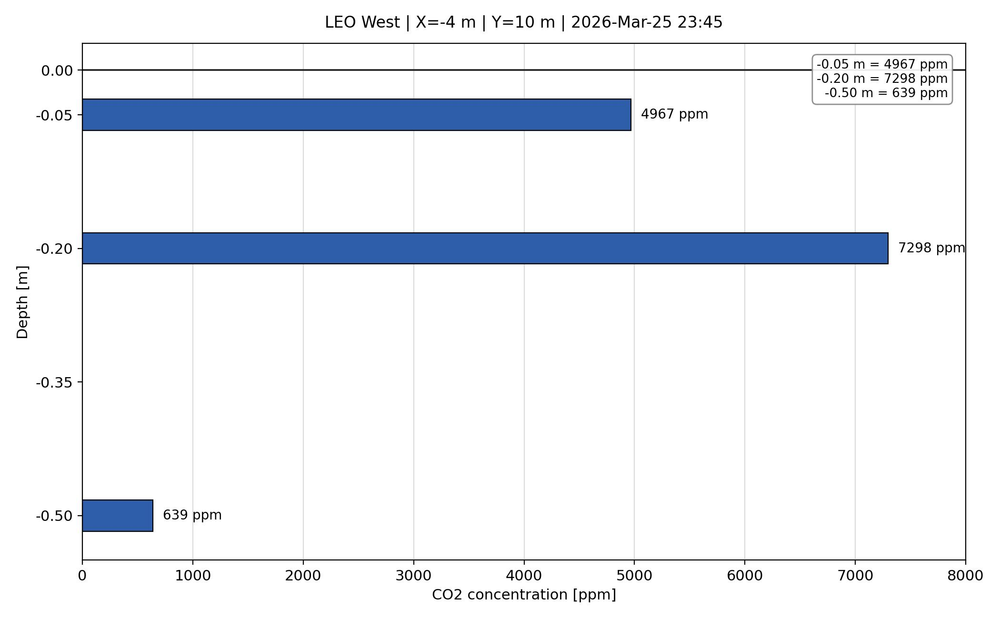

# CO2Flux

CO2Flux contains scripts to query Oracle data and generate CO2 outputs (including the vertical profile viewer GIF and JPEG exports).

## 1) Install Python

Use Python 3.11 or newer.

- Official download page: https://www.python.org/downloads/
- On Windows, enable the option to add Python to PATH during install.

Check your install:

```powershell
python --version
```

## 2) Oracle Database Driver Notes (python-oracledb)

This project uses the `oracledb` Python package from `requirements.txt`.

- Thin mode: often works without Oracle Instant Client.
- Thick mode: requires Oracle Instant Client (for some environments, especially when server-side encryption policies require it).

If you get an error like `DPY-3001` or `DPI-1047`, install Oracle Instant Client and set:

- `ORACLE_CLIENT_LIB_DIR` to the folder containing `oci.dll` (Windows), `libclntsh.dylib` (macOS), or `libclntsh.so` (Linux).

macOS note: Instant Client may not be needed unless your DB security policy requires Thick mode.

## 3) Create and Activate a Virtual Environment

From repo root:

### Windows (PowerShell)

```powershell
python -m venv venv
.\venv\Scripts\Activate.ps1
```

### macOS/Linux

```bash
python3 -m venv venv
source venv/bin/activate
```

## 4) Install Dependencies

```powershell
python -m pip install --upgrade pip
python -m pip install -r requirements.txt
```

## 5) Security Warning (Credentials)

Do not commit real credentials to git.

That is why this repo uses `.gitignore` to block local secret files while still allowing template files.

The repo `.gitignore` is configured as:

- ignored: `.env`, `.env.*`
- tracked: `.env.example`, `.emv.example`

## 6) Create Your Local .env from Template

Template files in this repo:

- `.env.example`
- `.emv.example`

Copy `.env.example` to `.env`, then add your real credentials:

```powershell
Copy-Item .env.example .env
```

Required keys:

- `ORACLE_HOST`
- `ORACLE_PORT`
- `ORACLE_SID`
- `ORACLE_USER`
- `ORACLE_PASSWORD`
- Optional: `ORACLE_CLIENT_LIB_DIR`

The viewer script checks `.env` in project root first.

## 7) Run the Code

Example run (from repo root):

```powershell
python Sensors_Description/co2_vertical_profile_viewer.py
```

Outputs are written under `Sensors_Description` as:

- animated GIF
- final JPEG

Example profile output:



## 8) Change Coordinates, Dates, and Extraction Settings

To change what data is extracted (slope, X/Y coordinates, start/end date), edit the TOML config:

- `Sensors_Description/co2_vertical_profile_viewer_config.toml`

You can also override locally with:

- `Sensors_Description/co2_vertical_profile_viewer_config.local.toml`

Recommended workflow:

1. Keep shared defaults in `co2_vertical_profile_viewer_config.toml`.
2. Put machine- or run-specific overrides in `co2_vertical_profile_viewer_config.local.toml`.
3. Run the script again.