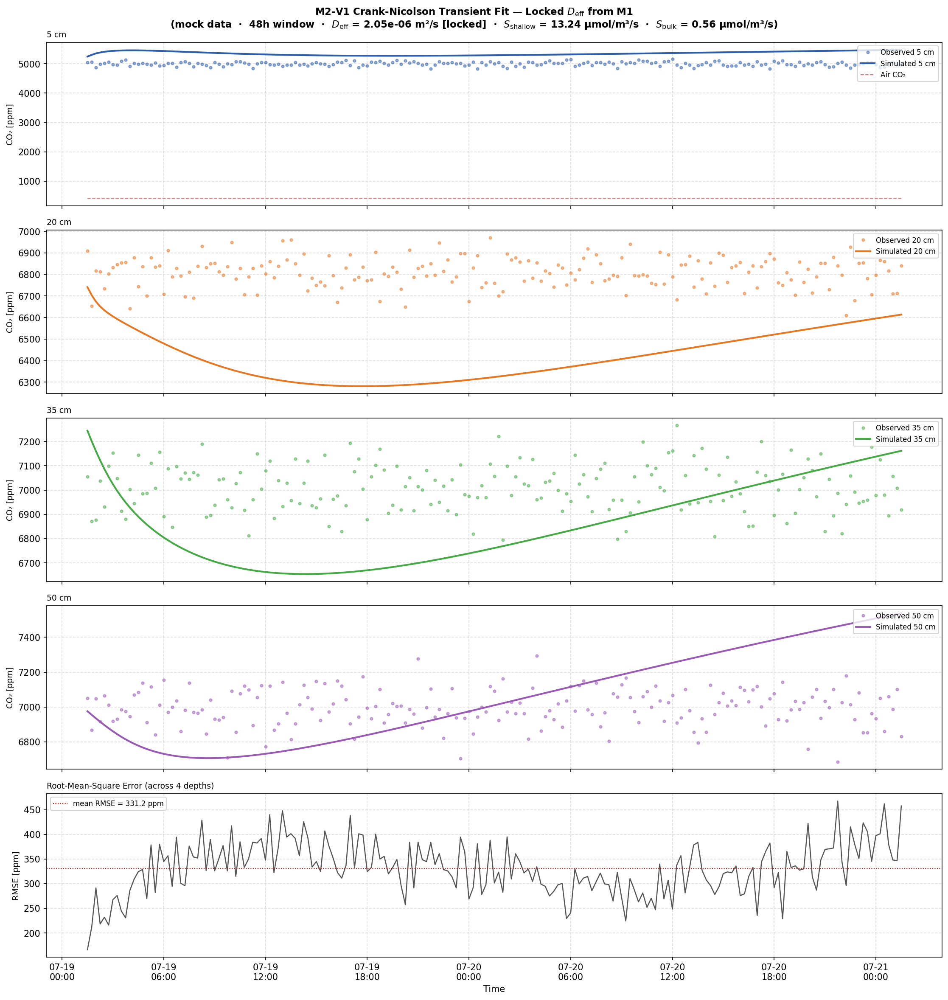
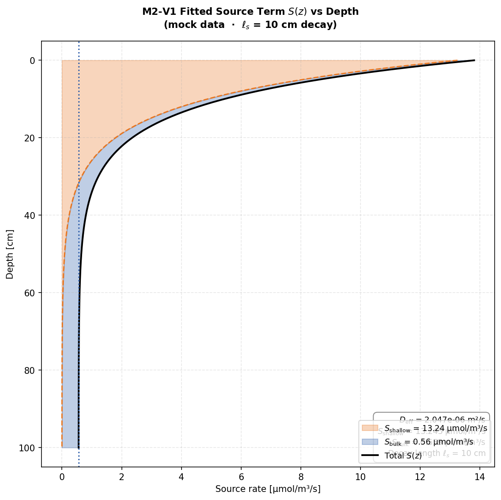
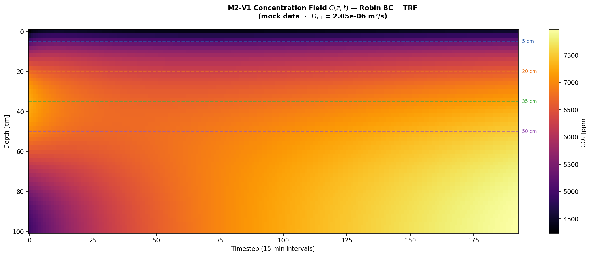

# CO₂ Flux Calculations — LEO West Basalt Biome

## 1. Data Preparation

### 1.1 Sensor Layout

Eight vertical sensor columns are installed across the LEO West basalt hillslope at Biosphere 2. Each column measures subsurface CO₂ concentration at three depths using Vaisala GMP251 probes, plus a co-located LI-7000 air sensor at the surface.

| Vertical | x | y | Depths (cm) | Ideal Period |
|----------|---|---|-------------|--------------|
| x=−1, y=4  | −1 | 4  | 5, 20, **50** | 2024-07-10 → 2024-07-29 |
| x=−1, y=10 | −1 | 10 | 5, 20, **35** | 2025-03-26 → 2025-04-06 |
| x=−1, y=18 | −1 | 18 | 5, 20, **35** | 2024-07-10 → 2024-07-29 |
| x=−1, y=24 | −1 | 24 | 5, 20, **50** | 2025-08-25 → 2025-09-13 |
| x=+1, y=4  | +1 | 4  | 5, 20, **50** | 2025-09-30 → 2025-10-03 |
| x=+1, y=10 | +1 | 10 | 5, 20, **35** | 2025-08-28 → 2025-09-10 |
| x=+1, y=18 | +1 | 18 | 5, 20, **35** | 2025-09-30 → 2025-10-03 |
| x=+1, y=24 | +1 | 24 | 5, 20, **50** | 2025-08-25 → 2025-09-13 |

The deepest sensor varies by position: **50 cm** at y=4 and y=24, **35 cm** at y=10 and y=18. This creates two natural geometry cohorts.

### 1.2 Ideal Period Selection

Each vertical has a manually curated **ideal period** — a contiguous window where all three subsurface sensors report clean, uninterrupted data. The timeline below shows how these ideal periods overlap across the eight verticals:


### 1.3 48-Hour Central Window

From each ideal period, we extract a **48-hour central window** (±24 h from midpoint) to ensure the most stable portion of the data. This avoids edge effects from sensor warmup or late-period degradation.

### 1.4 Quality Control Pipeline

Every 15-minute observation passes through a 6-check QC pipeline before entering the analysis:

1. **NaN detection** — flag missing readings per channel
2. **Duplicate timestamps** — remove exact duplicates
3. **±3σ outliers** — per-channel statistical screening
4. **413 ppm hardware artefact** — subsurface readings below 425 ppm flagged as sensor resets
5. **Cueva thermodynamic violation** — implied downward flux > 0.5 μmol m⁻² s⁻¹ indicates sensor malfunction
6. **Air > subsurface anomaly** — surface CO₂ exceeding a subsurface reading is physically implausible

Surviving gaps ≤ 1 hour (4 intervals) are forward-filled. Typical retention: **100%** of rows after QC.

### 1.5 Depth-Wise Cohort Averaging

The 8 verticals are split into two **geometry cohorts** based on their deepest sensor:

| Cohort | Verticals | Sensor Depths |
|--------|-----------|---------------|
| **Cohort 50** | y=4 and y=24 (both x) | 5, 20, 50 cm |
| **Cohort 35** | y=10 and y=18 (both x) | 5, 20, 35 cm |

Before combining, we validate **exchangeability** — the shared 5 cm and 20 cm time series from both cohorts must track each other closely. If the two cohorts show a sustained divergence > ~200 ppm at 20 cm, they represent distinct physical regimes and cannot be merged.


### 1.6 Composite Profile Construction

Assuming the exchangeability check passes, we stitch a **synthetic 5-depth composite profile**:

| Depth | Source |
|-------|--------|
| Air (z=0) | Average across all 8 verticals |
| 5 cm | Average across all 8 verticals |
| 20 cm | Average across all 8 verticals |
| 35 cm | Average from Cohort 35 only (4 verticals) |
| 50 cm | Average from Cohort 50 only (4 verticals) |

This produces a single DataFrame (`df_composite`) with 15-minute time series for all 5 levels across the 48-hour window.

---

## 2. M1 — SVD Cubic Polynomial Inversion

### 2.1 Governing Equation

Under quasi-steady-state conditions at each 15-minute snapshot, the CO₂ concentration profile in the basalt column satisfies the diffusion-reaction ODE:

$$\frac{d}{dz}\left[D_{\mathrm{eff}} \cdot \frac{dC}{dz}\right] + S(z) = 0$$

The general solution family compatible with a linearly varying source term is a **cubic polynomial**:

$$C(z) = az^3 + bz^2 + cz + d$$

with four unknown coefficients $(a, b, c, d)$.

### 2.2 Constraint System

The composite profile provides **four interior concentration measurements** plus a **zero-flux bottom boundary condition**:

$$M_{\mathrm{comp}} \cdot \begin{pmatrix} a \\ b \\ c \\ d \end{pmatrix} = \begin{pmatrix} C_{5} \\ C_{20} \\ C_{35} \\ C_{50} \\ 0 \end{pmatrix}$$

where the geometry matrix is:

$$M_{\mathrm{comp}} = \begin{pmatrix} 0.05^3 & 0.05^2 & 0.05 & 1 \\ 0.20^3 & 0.20^2 & 0.20 & 1 \\ 0.35^3 & 0.35^2 & 0.35 & 1 \\ 0.50^3 & 0.50^2 & 0.50 & 1 \\ 3L^2 & 2L & 1 & 0 \end{pmatrix}$$

Since $5 > 4$, this is an **overdetermined system**. There is no single cubic that passes exactly through all five constraints.

### 2.3 SVD Pseudoinverse Solution

We solve the overdetermined system via **Singular Value Decomposition (SVD)**, which automatically yields the optimal least-squares fit:

```
U, S, Vᴴ = SVD(M_comp)
M⁺ = Vᴴᵀ · diag(1/S) · Uᵀ
```

The pseudoinverse `M⁺` is computed **once** (it depends only on sensor geometry, not data). At every 15-minute timestep, the fit is executed by a single matrix multiplication:

```
[a(t), b(t), c(t), d(t)]ᵀ = M⁺ · [C₅(t), C₂₀(t), C₃₅(t), C₅₀(t), 0]ᵀ
```

This instantly produces the best-fit cubic coefficients for all 193 timesteps simultaneously — no iterative optimization required.

| Property | Value |
|----------|-------|
| Matrix size | 5×4 (overdetermined) |
| Condition number κ | 178.9 |
| Rank | 4 (full column rank) |

### 2.4 Extracting Physical Parameters

From the fitted coefficients at each timestep:

- **Inferred surface concentration**: $C(0) = d(t)$
- **Surface gradient**: $C'(0) = c(t)$ [ppm/m]
- **Effective diffusivity**:

$$D_{\mathrm{eff}} = \frac{k_g \cdot (C_{\mathrm{surface}} - C_{\mathrm{air}})}{C'(0)}$$

where $k_g = 10^{-5}$ m/s is the gas-transfer coefficient.

- **Column-averaged biological source term**: from the steady-state balance $S(z) = -D_{\mathrm{eff}} \cdot C''(z)$, integrated over the column:

$$\langle S_{\mathrm{bio}} \rangle = -D_{\mathrm{eff}} \cdot (3aL + 2b)$$

- **Surface flux**:

$$J_{\uparrow} = k_g \cdot c_{\mathrm{air}} \cdot (C_{\mathrm{surface}} - C_{\mathrm{air}}) \times 10^{-6} \quad [\mu\text{mol}\;\text{m}^{-2}\;\text{s}^{-1}]$$

### 2.5 Results

#### Fitted Cubic Profile vs Sensor Data

The left panel shows the time-mean SVD cubic $C(z)$ from the composite profile with the 5–95% timestep envelope. Sensor observations are overlaid as colored markers with ±1σ error bars. The right panel shows the implied source term $S(z)$ versus depth.


#### Physical Parameters Time Series

$D_{\mathrm{eff}}$, $\langle S_{\mathrm{bio}} \rangle$, and $J_\uparrow$ at 15-minute resolution across the 48-hour window:


#### Track A vs Track B Comparison

Two independent pipelines are compared as a cross-validation:

- **Track A** (Mean of the Physics): invert each of the 8 individual columns with its own 4×4 geometry matrix, then average the resulting $D_{\mathrm{eff}}$ and $J_\uparrow$.
- **Track B** (Physics of the Mean): pass the composite 5-depth profile through the overdetermined 5×4 SVD engine to extract a single global $D_{\mathrm{eff}}$ and $J_\uparrow$.


#### Summary Table

| Parameter | Track A | Track B |
|-----------|---------|---------|
| $D_{\mathrm{eff}}$ | 1.72 × 10⁻⁶ m²/s | 2.05 × 10⁻⁶ m²/s |
| $J_\uparrow$ | 1.46 × 10⁻⁶ μmol/m²s | 1.55 × 10⁻⁶ μmol/m²s |
| $\langle S_{\mathrm{bio}} \rangle$ | — | 0.038 ppm/s |
| SVD condition number κ | 208–366 | 178.9 |

### 2.6 How to Run M1

```bash
cd calculations
python composite_profile_pipeline.py
```

By default the script runs on **mock data** (no Oracle connection needed). To switch to real sensor data, set `USE_REAL_DATA = True` in `ideal_period_timeline.py`.

The pipeline executes all four phases automatically:

1. Loads 8 verticals, extracts 48h windows, runs QC
2. Validates cohort exchangeability (saves `phase1_exchangeability.png`)
3. Builds composite profile, constructs SVD pseudoinverse
4. Runs Track A + Track B inversions (saves `phase4_flux_comparison.png`)
5. Fits cubic depth profile, extracts $D_{\mathrm{eff}}$, $S_{\mathrm{bio}}$, $J_\uparrow$ (saves `svd_cubic_depth_profile.png`, `svd_physics_timeseries.png`)

All outputs are written to `out/composite/`. The CSV `composite_summary.csv` contains per-timestep Track A and Track B values for downstream analysis.

---

## 3. M2 — Transient Crank-Nicolson Inversion

### 3.1 Methodology: Transient State-Evolution

Moving beyond the steady-state instantaneous profile fits of M1, the system is modeled as a dynamical state-evolution problem using the 1D transient diffusion equation:

$$\frac{\partial C(z,t)}{\partial t} = D_{\mathrm{eff}} \frac{\partial^2 C(z,t)}{\partial z^2} + S_{\mathrm{total}}(z,t)$$

The PDE is discretized on a uniform grid ($N_z = 51$ nodes, $\Delta z = 2$ cm, column length $L = 1$ m) using a **Crank-Nicolson** finite-difference scheme, which is unconditionally stable and second-order accurate in both space and time. The time step matches the sensor polling interval ($\Delta t = 900$ s = 15 min).

Boundary conditions:

| Boundary | Type | Condition |
|----------|------|-----------|
| Top ($z = 0$) | Robin | $-D_{\mathrm{eff}} \partial_z C(0,t) = k_g\bigl(C(0,t) - C_{\mathrm{air}}(t)\bigr)$ |
| Bottom ($z = L$) | Neumann | $\partial C / \partial z = 0$ (zero-flux) |

The Robin condition at the surface lets the top grid node float to whatever concentration balances the upward diffusive flux against gas-exchange loss to the atmosphere ($k_g = 10^{-5}$ m/s). This replaces the provisional Dirichlet assumption ($C(0,t) = C_{\mathrm{air}}$) that artificially pinned the surface to ambient air.

An inverse modeling approach is used to fit the physical parameters ($D_{\mathrm{eff}}$ and source amplitudes). A forward solver simulates the time-evolution of the full column, and a **Trust Region Reflective (TRF)** least-squares optimizer with **soft_l1** robust loss minimizes the residual vector between the simulated nodes and the physical sensor data at 5 cm, 20 cm, 35 cm, and 50 cm.

### 3.2 Source Parameterization

The biological source is separated into two spatial components to represent the distinct physical realities of the basalt matrix:

$$S_{\mathrm{total}}(z,t) = S_{\mathrm{shallow}}(z,t) + S_{\mathrm{bulk}}(z,t)$$

- **Shallow Source:** An exponentially decaying biological production layer (e.g., surface crust/microbes):
  $$S_{\mathrm{shallow}}(z) = S_{\mathrm{sh}} \cdot \exp\!\left(-\frac{z}{\ell_s}\right), \quad \ell_s = 10\;\text{cm}$$
- **Bulk Source:** A uniform background production rate deep within the column:
  $$S_{\mathrm{bulk}}(z) = S_{\mathrm{bk}} = \text{const}$$

Three parameters are fitted simultaneously: $D_{\mathrm{eff}}$, $S_{\mathrm{sh}}$, $S_{\mathrm{bk}}$.

However, fitting all three simultaneously from a sparse sensor array creates an identifiability problem: diffusion and source strengths can trade off mathematically (higher diffusion + higher production mimics lower diffusion + lower production). The optimizer exploits this loophole, pinning $D_{\mathrm{eff}}$ to its lower bound and producing unphysical negative surface fluxes.

**Resolution — M1 Anchoring:** $D_{\mathrm{eff}}$ is **locked** to the value independently proven by the M1 SVD Track B steady-state inversion ($2.047 \times 10^{-6}$ m²/s). The optimizer fits only the two biological source amplitudes $S_{\mathrm{sh}}$ and $S_{\mathrm{bk}}$, reducing the problem to 2 dimensions and eliminating the $D/S$ identifiability degeneracy.

| Parameter | Status | Value / Bounds |
|-----------|--------|----------------|
| $D_{\mathrm{eff}}$ [m²/s] | **Locked** | $2.047 \times 10^{-6}$ (from M1 Track B) |
| $S_{\mathrm{sh}}$ [μmol/m³/s] | Fitted | $[0,\; 50]$ |
| $S_{\mathrm{bk}}$ [μmol/m³/s] | Fitted | $[0,\; 10]$ |

### 3.3 V1 — Time-Invariant Sources (Locked $D_{\mathrm{eff}}$, Molar-Strict, Multi-Start)

Version 1 assumes **time-constant** source amplitudes over the 48-hour fitting window. The source profile $S(z)$ has spatial structure (shallow exponential + bulk uniform) but does not vary with time. The effective diffusivity is **locked** to the M1 Track B value ($2.047 \times 10^{-6}$ m²/s); only $S_{\mathrm{sh}}$ and $S_{\mathrm{bk}}$ are optimized.

The V1 implementation incorporates three reviewer-hardened engineering improvements:

1. **Strict molar units** — the entire PDE and optimizer operate in mol/m³. Conversions to ppm are reserved for final plotting and CSV export. The single `c_{\mathrm{air}} = 40.9$ mol/m³ scaling factor is isolated at the top of the file, so adjusting for biome-specific barometric pressure and temperature requires changing only one variable.

2. **Parameter scaling** — the optimizer fits scaled multipliers near $O(1)$ (physical value = multiplier $\times 10^{-6}$), keeping L-BFGS-B gradient estimation well-conditioned across the 6-order-of-magnitude spread between $D_{\mathrm{eff}}$ and the source terms.

3. **Multi-start optimization** — $n = 10$ random initial guesses are deployed across the parameter space. Each rolls downhill independently via L-BFGS-B, and the global-minimum solution is selected. This mitigates the $D/S$ trade-off identifiability risk flagged by the reviewer.

Additionally, the Crank-Nicolson tridiagonal matrices use **separate arrays** for upper and lower off-diagonals, preventing the ghost-node Neumann BC from corrupting the upper diagonal via shared-reference aliasing — a bug that caused numerical blowup to $O(10^{268})$ in the initial prototype.

A Fourier mesh number diagnostic is reported at runtime:
$$F_o = \frac{D_{\mathrm{eff}} \, \Delta t}{\Delta z^2}$$
For $F_o \le 1$ the CN solution is guaranteed smooth; values above 1 may exhibit non-physical oscillations near sharp gradients (addressable by increasing $N_z$ or reducing $\Delta t$).

#### Results (V1)







#### How to Run M2-V1

```bash
cd calculations
python v2_crank_nicolson_pipeline.py
```

The pipeline:
1. Loads composite profile via the same data/QC chain as M1
2. Builds initial $C(z, 0)$ in mol/m³ by interpolation through sensor observations
3. Locks $D_{\mathrm{eff}}$ at M1 Track B value ($2.047 \times 10^{-6}$ m²/s)
4. Runs TRF least-squares optimisation (`soft_l1` loss) fitting only $S_{\mathrm{sh}}$ and $S_{\mathrm{bk}}$
5. Reports Fourier mesh number $F_o$ diagnostic
6. Exports time series fit, concentration field heatmap, and source profile figures to `out/V2/`
7. Writes `v2_summary.csv` with per-timestep observed/simulated values (ppm) and surface flux (μmol/m²s)

### 3.4 V2 Roadmap — Temperature-Dependent Sources

The next iteration will couple $S_{\mathrm{total}}(z,t)$ to measured temperature $T(t)$, recognizing that shallow biological production responds dynamically to environmental forcing. This transforms the static $S(z)$ into a true dynamic $S(z, T(t))$, coupling the biology directly to the thermal environment.

### 3.5 Current Modeling Assumptions & Limitations

This initial transient inversion (V1) relies on several provisional assumptions that will be updated in subsequent versions:

- **Time-Invariant Sources (V1):** Version 1 assumes time-constant source amplitudes over the localized 48-hour fitting window. **Roadmap for V2:** The next iteration will couple $S_{\mathrm{total}}(z,t)$ to measured temperature $T(t)$, recognizing that shallow biological production responds dynamically to environmental forcing.
- **Top Boundary Coupling (implemented):** The model enforces a Robin gas-exchange condition at the surface: $-D_{\mathrm{eff}} \partial_z C(0,t) = k_g(C(0,t) - C_{\mathrm{air}}(t))$, with $k_g = 10^{-5}$ m/s. This lets the surface node float naturally above ambient air concentration, representing the physical reality that the rate of CO₂ diffusing upward from the soil must match the rate escaping into the atmosphere. The initial Dirichlet assumption ($C(0,t) = C_{\mathrm{air}}$) caused $S_{\mathrm{shallow}}$ to hit its upper bound.
- **Initial Conditions:** The $t=0$ state is currently estimated using linear interpolation between the atmospheric concentration and the sensor depths. Short fitting windows may result in the optimizer compensating for a poor initial condition. Future runs will incorporate a spin-up period prior to the fitting window.
- **M1 Anchoring Strategy (implemented):** The M1 SVD pipeline yields an independent $D_{\mathrm{eff}}$ estimate (Track B: $2.047 \times 10^{-6}$ m²/s). The production M2-V1 implementation **locks** $D_{\mathrm{eff}}$ at this M1 value and fits only the two source amplitudes ($S_{\mathrm{sh}}$, $S_{\mathrm{bk}}$), reducing the problem to 2 free parameters. This eliminates the $D/S$ identifiability degeneracy and rigorously demonstrates compatibility between the steady-state and transient models.

### 3.6 Identifiability and Optimization Constraints

Extracting $D_{\mathrm{eff}}$, $S_{\mathrm{shallow}}$, and $S_{\mathrm{bulk}}$ simultaneously from a sparse vertical sensor array presents identifiability challenges. Diffusion limits and source strengths can theoretically trade off against each other mathematically (e.g., higher diffusion coupled with higher production mimicking lower diffusion and lower production).

**Implemented mitigations:**
- TRF (Trust Region Reflective) least-squares optimizer with `soft_l1` robust loss, immune to L-BFGS-B Armijo flat-valley stalling and down-weighting outlier spikes.
- Parameter scaling to O(1) multipliers for well-conditioned Jacobian estimation.
- Strict molar unit system eliminating hybrid-unit numerical artefacts.
- $D_{\mathrm{eff}}$ locked to M1 Track B estimate ($2.047 \times 10^{-6}$ m²/s), reducing the fit to 2 free parameters and eliminating the $D/S$ degeneracy.
- Robin BC freeing the surface node from the Dirichlet straitjacket that previously caused $S_{\mathrm{shallow}}$ to saturate at its upper bound.

**Planned mitigations:**
- Regularization on source magnitudes.
- Sensitivity analysis and profile likelihoods to establish confidence intervals for the inferred physical properties.

---

## 4. Scripts

| Script | Purpose |
|--------|---------|
| `ideal_period_timeline.py` | VERTICALS catalogue + shared data loaders + timeline figure |
| `golden_48h_analysis.py` | 48h extraction, QC, ensemble build, V1 regression, V2 Crank-Nicolson |
| `composite_profile_pipeline.py` | M1: Dual-track SVD pipeline (Phase 1–4) + cubic depth profile diagnostics |
| `v2_crank_nicolson_pipeline.py` | M2-V1: Transient Crank-Nicolson inversion with two-source model |
| `cubic_profile_projection.py` | Per-vertical cubic fit + air-validation time series |
| `averaged_timeline.py` | Ensemble-averaged timeline + golden CSV export |
| `depth_profile_48h.py` | Per-vertical depth profile + 48h time-series figure |

## 5. Output Directory

```
out/
├── composite/                         ← M1 SVD pipeline
│   ├── phase1_exchangeability.png
│   ├── phase4_flux_comparison.png
│   ├── svd_cubic_depth_profile.png
│   ├── svd_physics_timeseries.png
│   └── composite_summary.csv
├── V2/                                ← M2-V1 Crank-Nicolson pipeline
│   ├── v2_timeseries_fit.png
│   ├── v2_concentration_field.png
│   ├── v2_source_profile.png
│   ├── phase1_exchangeability.png
│   └── v2_summary.csv
├── golden_48h/                        ← 48h QC + ensemble
│   ├── depth_profile_avg.png
│   ├── timeseries_48h.png
│   ├── goldenslice_48h.csv
│   ├── V1/
│   └── V2/
├── timeline/                          ← Ideal period overview
├── ensemble/                          ← Averaged timelines
└── depth_profile/                     ← Per-vertical profiles
```