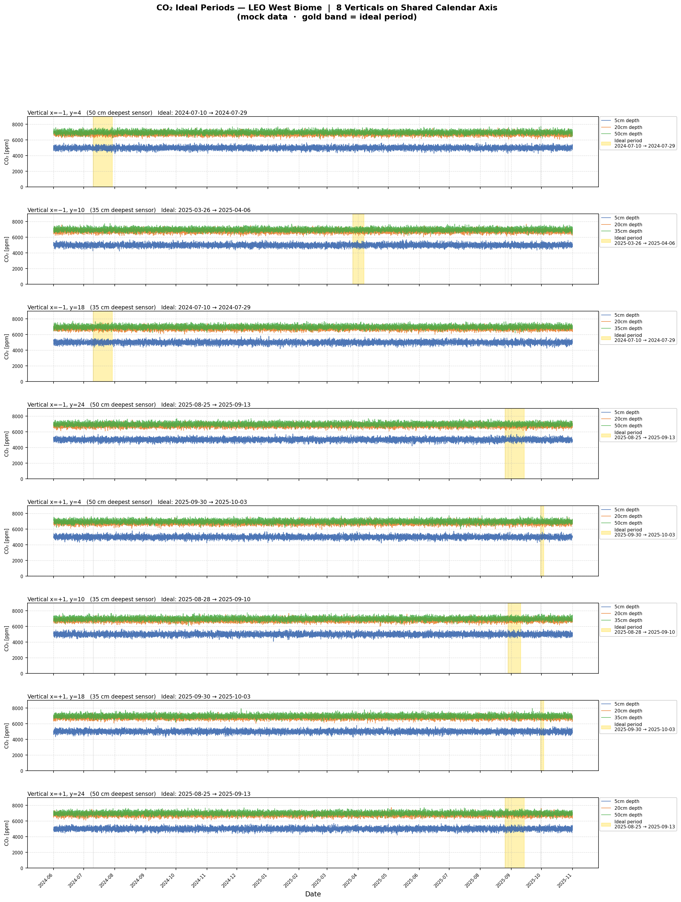
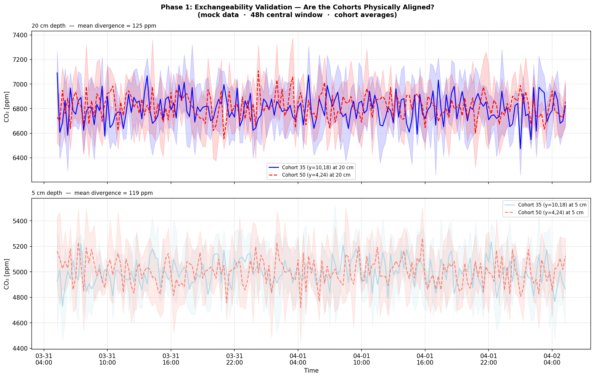
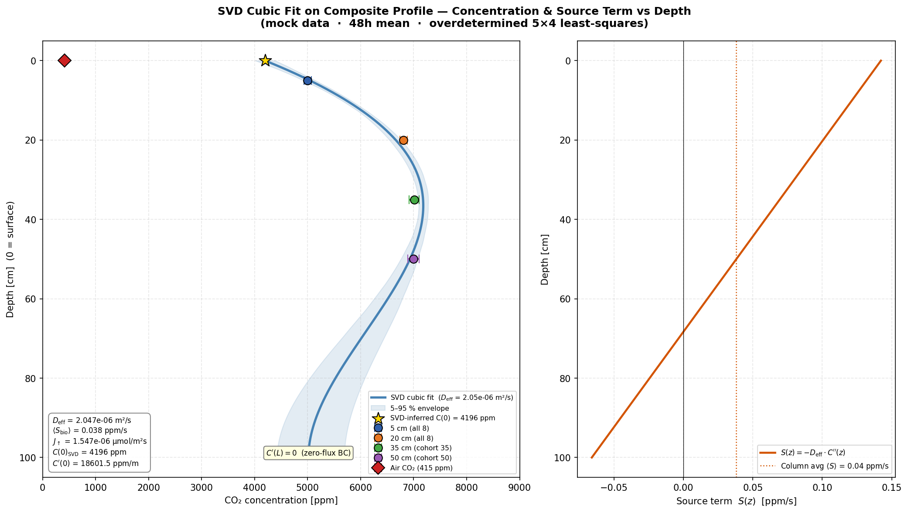
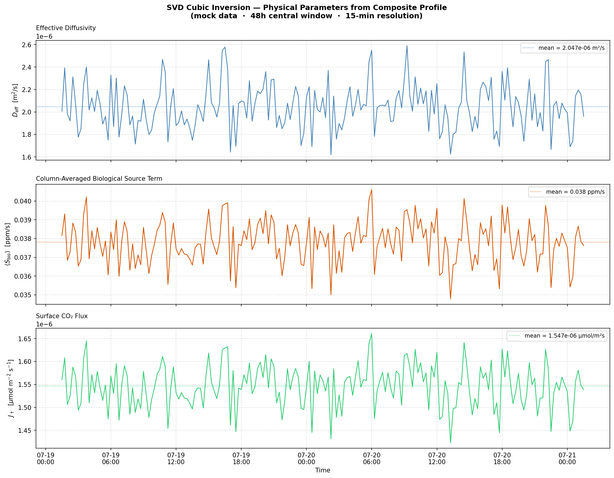
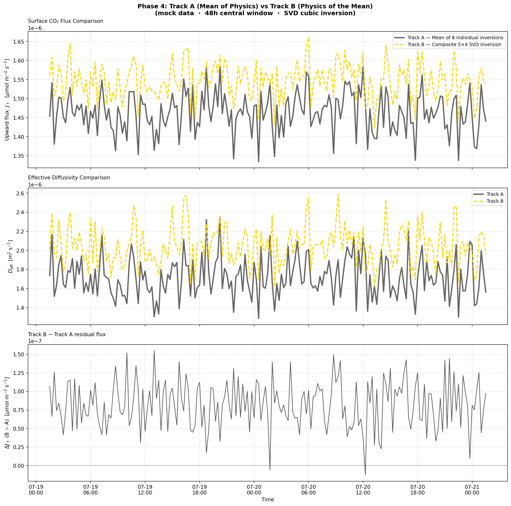

# CO₂ Flux Calculations — LEO West Basalt Biome

## 1. Data Preparation

### 1.1 Sensor Layout

Eight vertical sensor columns are installed across the LEO West basalt hillslope at Biosphere 2. Each column measures subsurface CO₂ concentration at three depths using Vaisala GMP251 probes, plus a co-located LI-7000 air sensor at the surface.

| Vertical | x | y | Depths (cm) | Ideal Period |
|----------|---|---|-------------|--------------|
| x=−1, y=4  | −1 | 4  | 5, 20, **50** | 2024-07-10 → 2024-07-29 |
| x=−1, y=10 | −1 | 10 | 5, 20, **35** | 2025-03-26 → 2025-04-06 |
| x=−1, y=18 | −1 | 18 | 5, 20, **35** | 2024-07-10 → 2024-07-29 |
| x=−1, y=24 | −1 | 24 | 5, 20, **50** | 2025-08-25 → 2025-09-13 |
| x=+1, y=4  | +1 | 4  | 5, 20, **50** | 2025-09-30 → 2025-10-03 |
| x=+1, y=10 | +1 | 10 | 5, 20, **35** | 2025-08-28 → 2025-09-10 |
| x=+1, y=18 | +1 | 18 | 5, 20, **35** | 2025-09-30 → 2025-10-03 |
| x=+1, y=24 | +1 | 24 | 5, 20, **50** | 2025-08-25 → 2025-09-13 |

The deepest sensor varies by position: **50 cm** at y=4 and y=24, **35 cm** at y=10 and y=18. This creates two natural geometry cohorts.

### 1.2 Ideal Period Selection

Each vertical has a manually curated **ideal period** — a contiguous window where all three subsurface sensors report clean, uninterrupted data. The timeline below shows how these ideal periods overlap across the eight verticals:



### 1.3 48-Hour Central Window

From each ideal period, we extract a **48-hour central window** (±24 h from midpoint) to ensure the most stable portion of the data. This avoids edge effects from sensor warmup or late-period degradation.

### 1.4 Quality Control Pipeline

Every 15-minute observation passes through a 6-check QC pipeline before entering the analysis:

1. **NaN detection** — flag missing readings per channel
2. **Duplicate timestamps** — remove exact duplicates
3. **±3σ outliers** — per-channel statistical screening
4. **413 ppm hardware artefact** — subsurface readings below 425 ppm flagged as sensor resets
5. **Cueva thermodynamic violation** — implied downward flux > 0.5 μmol m⁻² s⁻¹ indicates sensor malfunction
6. **Air > subsurface anomaly** — surface CO₂ exceeding a subsurface reading is physically implausible

Surviving gaps ≤ 1 hour (4 intervals) are forward-filled. Typical retention: **100%** of rows after QC.

### 1.5 Depth-Wise Cohort Averaging

The 8 verticals are split into two **geometry cohorts** based on their deepest sensor:

| Cohort | Verticals | Sensor Depths |
|--------|-----------|---------------|
| **Cohort 50** | y=4 and y=24 (both x) | 5, 20, 50 cm |
| **Cohort 35** | y=10 and y=18 (both x) | 5, 20, 35 cm |

Before combining, we validate **exchangeability** — the shared 5 cm and 20 cm time series from both cohorts must track each other closely. If the two cohorts show a sustained divergence > ~200 ppm at 20 cm, they represent distinct physical regimes and cannot be merged.



### 1.6 Composite Profile Construction

Assuming the exchangeability check passes, we stitch a **synthetic 5-depth composite profile**:

| Depth | Source |
|-------|--------|
| Air (z=0) | Average across all 8 verticals |
| 5 cm | Average across all 8 verticals |
| 20 cm | Average across all 8 verticals |
| 35 cm | Average from Cohort 35 only (4 verticals) |
| 50 cm | Average from Cohort 50 only (4 verticals) |

This produces a single DataFrame (`df_composite`) with 15-minute time series for all 5 levels across the 48-hour window.

---

## 2. V1 — SVD Cubic Polynomial Inversion

### 2.1 Governing Equation

Under quasi-steady-state conditions at each 15-minute snapshot, the CO₂ concentration profile in the basalt column satisfies the diffusion-reaction ODE:

$$\frac{d}{dz}\left[D_{\mathrm{eff}} \cdot \frac{dC}{dz}\right] + S(z) = 0$$

The general solution family compatible with a linearly varying source term is a **cubic polynomial**:

$$C(z) = az^3 + bz^2 + cz + d$$

with four unknown coefficients $(a, b, c, d)$.

### 2.2 Constraint System

The composite profile provides **four interior concentration measurements** plus a **zero-flux bottom boundary condition**:

$$M_{\mathrm{comp}} \cdot \begin{pmatrix} a \\ b \\ c \\ d \end{pmatrix} = \begin{pmatrix} C_{5} \\ C_{20} \\ C_{35} \\ C_{50} \\ 0 \end{pmatrix}$$

where the geometry matrix is:

$$M_{\mathrm{comp}} = \begin{pmatrix} 0.05^3 & 0.05^2 & 0.05 & 1 \\ 0.20^3 & 0.20^2 & 0.20 & 1 \\ 0.35^3 & 0.35^2 & 0.35 & 1 \\ 0.50^3 & 0.50^2 & 0.50 & 1 \\ 3L^2 & 2L & 1 & 0 \end{pmatrix}$$

Since $5 > 4$, this is an **overdetermined system**. There is no single cubic that passes exactly through all five constraints.

### 2.3 SVD Pseudoinverse Solution

We solve the overdetermined system via **Singular Value Decomposition (SVD)**, which automatically yields the optimal least-squares fit:

```
U, S, Vᴴ = SVD(M_comp)
M⁺ = Vᴴᵀ · diag(1/S) · Uᵀ
```

The pseudoinverse `M⁺` is computed **once** (it depends only on sensor geometry, not data). At every 15-minute timestep, the fit is executed by a single matrix multiplication:

```
[a(t), b(t), c(t), d(t)]ᵀ = M⁺ · [C₅(t), C₂₀(t), C₃₅(t), C₅₀(t), 0]ᵀ
```

This instantly produces the best-fit cubic coefficients for all 193 timesteps simultaneously — no iterative optimization required.

| Property | Value |
|----------|-------|
| Matrix size | 5×4 (overdetermined) |
| Condition number κ | 178.9 |
| Rank | 4 (full column rank) |

### 2.4 Extracting Physical Parameters

From the fitted coefficients at each timestep:

- **Inferred surface concentration**: $C(0) = d(t)$
- **Surface gradient**: $C'(0) = c(t)$ [ppm/m]
- **Effective diffusivity**:

$$D_{\mathrm{eff}} = \frac{k_g \cdot (C_{\mathrm{surface}} - C_{\mathrm{air}})}{C'(0)}$$

where $k_g = 10^{-5}$ m/s is the gas-transfer coefficient.

- **Column-averaged biological source term**: from the steady-state balance $S(z) = -D_{\mathrm{eff}} \cdot C''(z)$, integrated over the column:

$$\langle S_{\mathrm{bio}} \rangle = -D_{\mathrm{eff}} \cdot (3aL + 2b)$$

- **Surface flux**:

$$J_{\uparrow} = k_g \cdot c_{\mathrm{air}} \cdot (C_{\mathrm{surface}} - C_{\mathrm{air}}) \times 10^{-6} \quad [\mu\text{mol}\;\text{m}^{-2}\;\text{s}^{-1}]$$

### 2.5 Results

#### Fitted Cubic Profile vs Sensor Data

The left panel shows the time-mean SVD cubic $C(z)$ from the composite profile with the 5–95% timestep envelope. Sensor observations are overlaid as colored markers with ±1σ error bars. The right panel shows the implied source term $S(z)$ versus depth.



#### Physical Parameters Time Series

$D_{\mathrm{eff}}$, $\langle S_{\mathrm{bio}} \rangle$, and $J_\uparrow$ at 15-minute resolution across the 48-hour window:



#### Track A vs Track B Comparison

Two independent pipelines are compared as a cross-validation:

- **Track A** (Mean of the Physics): invert each of the 8 individual columns with its own 4×4 geometry matrix, then average the resulting $D_{\mathrm{eff}}$ and $J_\uparrow$.
- **Track B** (Physics of the Mean): pass the composite 5-depth profile through the overdetermined 5×4 SVD engine to extract a single global $D_{\mathrm{eff}}$ and $J_\uparrow$.



#### Summary Table

| Parameter | Track A | Track B |
|-----------|---------|---------|
| $D_{\mathrm{eff}}$ | 1.72 × 10⁻⁶ m²/s | 2.05 × 10⁻⁶ m²/s |
| $J_\uparrow$ | 1.46 × 10⁻⁶ μmol/m²s | 1.55 × 10⁻⁶ μmol/m²s |
| $\langle S_{\mathrm{bio}} \rangle$ | — | 0.038 ppm/s |
| SVD condition number κ | 208–366 | 178.9 |

### 2.6 How to Run V1

```bash
cd calculations
python composite_profile_pipeline.py
```

By default the script runs on **mock data** (no Oracle connection needed). To switch to real sensor data, set `USE_REAL_DATA = True` in `ideal_period_timeline.py`.

The pipeline executes all four phases automatically:

1. Loads 8 verticals, extracts 48h windows, runs QC
2. Validates cohort exchangeability (saves `phase1_exchangeability.png`)
3. Builds composite profile, constructs SVD pseudoinverse
4. Runs Track A + Track B inversions (saves `phase4_flux_comparison.png`)
5. Fits cubic depth profile, extracts $D_{\mathrm{eff}}$, $S_{\mathrm{bio}}$, $J_\uparrow$ (saves `svd_cubic_depth_profile.png`, `svd_physics_timeseries.png`)

All outputs are written to `out/composite/`. The CSV `composite_summary.csv` contains per-timestep Track A and Track B values for downstream analysis.

---

## 3. Scripts

| Script | Purpose |
|--------|---------|
| `ideal_period_timeline.py` | VERTICALS catalogue + shared data loaders + timeline figure |
| `golden_48h_analysis.py` | 48h extraction, QC, ensemble build, V1 regression, V2 Crank-Nicolson |
| `composite_profile_pipeline.py` | Dual-track SVD pipeline (Phase 1–4) + cubic depth profile diagnostics |
| `cubic_profile_projection.py` | Per-vertical cubic fit + air-validation time series |
| `averaged_timeline.py` | Ensemble-averaged timeline + golden CSV export |
| `depth_profile_48h.py` | Per-vertical depth profile + 48h time-series figure |

## 4. Output Directory

```
out/
├── composite/                         ← V1 SVD pipeline
│   ├── phase1_exchangeability.png
│   ├── phase4_flux_comparison.png
│   ├── svd_cubic_depth_profile.png
│   ├── svd_physics_timeseries.png
│   └── composite_summary.csv
├── golden_48h/                        ← 48h QC + ensemble
│   ├── depth_profile_avg.png
│   ├── timeseries_48h.png
│   ├── goldenslice_48h.csv
│   ├── V1/
│   └── V2/
├── timeline/                          ← Ideal period overview
├── ensemble/                          ← Averaged timelines
└── depth_profile/                     ← Per-vertical profiles
```